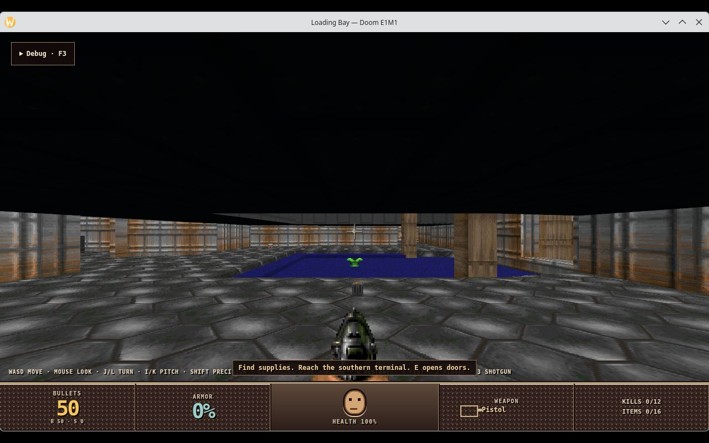

# Desktop runtime pack published with each pair (#8860)

The pair workflow now publishes a desktop runtime pack beside every pair, and
`rusty dev` fetches it for `RUSTY_RENDER_OUTPUT=window`. Doom runs in a native
window from a published pair with no Engine checkout involved.



## Publication

Pair workflow run 36602271679 on `9857de734` passed every step:
- build;
- the packaged consumer;
- the Chromium distribution restore;
- the desktop pack build and its ABI comparison;
- publication.

Release `csharp-sdk-v0.1.0-dev.9857de734847` carries:

| Asset | Bytes |
|---|---|
| `rusty-engine-csharp-pair-0.1.0-dev.9857de734847-linux-x64.tar.gz` | 88,334,140 |
| `rusty-engine-desktop-pack-0.1.0-dev.9857de734847-linux-x64.tar.xz` | 165,094,816 |
| each one's `.sha256` | |

`pair-release.json` names the desktop pack under `desktopPack`, with its
SHA-256 (`25e65706…4940d22`), size and URL. The pack's ABI fingerprint
(`6297d14a…6fd149c700`) is the pair's.

## Fetch and run, from the published pair

On the test machine, with no local Engine build involved:

1. `scripts/install-rusty.sh`, the published bootstrap, installed the pair's
   `rusty` into `~/.local/bin`.
2. `rusty update` in rusty-doom moved its pin from `b13d4a897b41` to
   `9857de734847`. The product built unchanged.
3. `RUSTY_RENDER_OUTPUT=window scripts/run-csharp-product.sh` ran with no
   `--runtime` and no `--engine-source`, under the headless KWin from #8859.
   - `rusty` downloaded the desktop pack, checked it and extracted it to
     `~/.cache/rusty-engine/pairs/0.1.0-dev.9857de734847/desktop-pack`.
   - It then ran the product on that pack's host:
     ```
     rusty: downloading the desktop runtime pack for Engine pair 0.1.0-dev.9857de734847
     RUSTY_DEV {"detail":{"pin":"0.1.0-dev.9857de734847",…,"runtimePack":"…/pairs/0.1.0-dev.9857de734847/desktop-pack"},"event":"pin-resolved",…}
     ```
   - From the command to the listening host took 18 s, including the 165 MB
     download.
   - Over 74 s the window presented 4,265 frames and skipped none. There were
     3 UI imports and no import errors (`RUSTY_DESKTOP` report).

## Installed pack

| Part | Size |
|---|---|
| `lib/cef` | 292 MB: `libcef.so` 257 MB, `resources.pak` 21 MB, ICU data 11 MB, paks, V8 snapshot, ANGLE, one locale |
| `bin` | 241 MB (host and `rusty`, with debug info) |
| `symbols` | 210 MB |
| `share` | 22 MB (browser shell, live-debug, third-party notices and MPL sources) |

`lib/cef` holds no SwiftShader and no bundled Vulkan loader.

## Window placement: found and fixed

The first placement code saved winit's frame position (`outer_position`) and
restored it with `with_position`. On X11 through KWin's Xwayland, the window
crept down by its title bar (36 px) on every run:

| Run | Saved before | Client area | Saved after |
|---|---|---|---|
| 1 | `1000 600 120 80 0` | 1000×600 at 120,116 | `1000 600 120 116 0` |
| 2 | `1000 600 120 116 0` | 1000×600 at 120,152 | `1000 600 120 152 0` |

- **Cause.** KWin sets `_NET_FRAME_EXTENTS` (top 36) but does not reparent
  Xwayland windows.
  - winit then treats the window as unnested and zeroes the extents, so
    `outer_position` returns the client area.
  - `with_position` still places the frame.
- **Fix (`desktop-shell/src/placement.rs`).** Save the client area's position.
  - Restore it with `with_position`.
  - Once the client area reports where it landed, move the window back by
    the difference, once. It checks right after creation and on the first
    `Moved` event, within 2 s. A later move is the user's.
  - The correction uses only the requested and landed client positions,
    never winit's frame position.

After the fix (`x11-placement.sh`, two runs):

| Run | Saved before | Client area | Saved after |
|---|---|---|---|
| 1 | `1000 600 120 80 0` | 1000×600 at 120,80 | `1000 600 120 80 0` |
| 2 | `1000 600 120 80 0` | 1000×600 at 120,80 | `1000 600 120 80 0` |

On Wayland no position is reported. The published pack saved
`1280 720 - - 0` when it stopped, and size and maximized state restore.

## Checks

- `cargo clippy -p desktop-shell --all-targets -D warnings` and
  `cargo test -p desktop-shell` pass.
- A `--desktop` pack built from the fix ran both X11 placement runs above.

## Limits

- Placement was measured on KWin, on Wayland and on Xwayland. The fix assumes
  a window's first move is the window manager placing it. On a platform
  without frame offsets it changes nothing.
- The desktop pack was run on RADV only, as the trim was measured (#8790).
