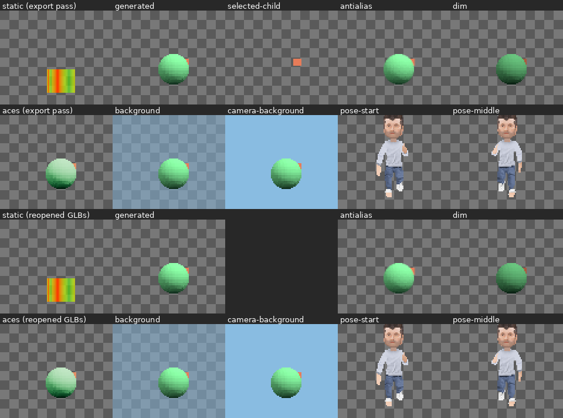

# RenderOutput jobs in the runtime (#8826)

`engine.RenderOutput.CaptureImage` and `ExportSceneGlb` now complete inside the
runtime, with no browser attached.
- **Images** render through render-wgpu's `capture_image`.
- **GLBs** are written by the new `render_wgpu::export_glb`.

The browser output executor is out of the path, so #8792 can delete
`renderer-three/src/render-output.ts` and lose no C# capability.



## Proof: the release-pair consumer, no browser

`scripts/test-csharp-release-pair.sh` builds a clean package-only consumer
from a pair built at this change (`0.1.0-dev.a04090f05c4b`). That build
predates the rebase onto main `faa4c4531`, which brought #8846–#8852's
render-wgpu changes; after the rebase the focused suites below were rerun,
and the pair was not rebuilt (the shared disk was full). The consumer runs
`scripts/fixtures/RenderOutputChecks.cs` in the packaged `rusty-product-host`.
Until now the script passed `--headless`, which launched Chromium to execute
the jobs; it no longer does.

- **Export pass.**
  - 14 captures: static, generated, the selected child, exposure, ACES,
    supersampling, clear and camera backgrounds, and three exact poses.
  - Four GLBs: the static GLB, the generated mesh with its child cube, the
    selected child alone, and the animated character with its clips.
  - `verify-render-outputs.py` passes. It checks the transparent backgrounds,
    the exact background colour and alpha (137, 188, 225, 128), and that
    exposure and ACES change the image. It also checks the child selection
    against its ancestor, the skins and the `run` clip.
- **Reopen pass.**
  - The exported GLBs are staged as the consumer's content and reopened
    through `Animation.OpenAnimatedMesh`, then captured again.
  - Every capture of a reopened GLB is byte-identical to the export pass's
    capture of the original: the static wall, the generated mesh with its
    child, and each sampled pose of the reopened character.
- **No browser.** Neither host log mentions Chromium. The only device is the
  wgpu adapter, RADV on this machine.

## Execution (`csharp-product-runtime/src/render_output.rs`)

- **Handing jobs over.**
  - `finish_call` settles each new request into a frozen job, as before.
  - It hands the job to the runtime once, as `RenderOutputWork`: the job, the
    Arc-backed resources its frame reads, and its completion.
  - The runtime hands the work over before any fallible step, including work
    from the create callback.
- **The worker.**
  - One `rusty-render-output` thread runs jobs in settle order, off the
    product call path.
  - It creates its wgpu device on the first image job, using the product's
    `RendererOptions` (its default lights). A GLB export needs no GPU.
- **Results.**
  - `RenderOutputWork::complete` delivers the bytes or the diagnostic. The
    services apply it when the next call begins, so the product reads it from
    that callback on.
  - Cancelled and destroyed jobs stay so.
  - Work dropped unfinished (a stopped worker) fails with a diagnostic instead
    of staying pending forever.

## Removed with the browser path

Each of these existed only to carry jobs to a browser and bytes back:

- the `RuntimePublication::RenderOutput` replacement snapshot of pending jobs,
  its wire variant, its `published`/`changed_jobs` dedupe and its fresh-baseline
  republication;
- `RenderOutputChunk` and the chunked ingest: 32 KiB transfers, offsets,
  retries, and the contiguity check;
- the `render-output-feedback` endpoint, `ProductDevRenderOutputFeedback` and
  its validation, the operation kind, the session wrapper and the runtime
  method;
- job resources in the served renderer-resource inventory, which the browser
  fetched them through;
- the TypeScript job loop and feedback transport in `product-browser-host`,
  and the TS `RenderOutputChunk` contract.

renderer-three's executor and the `executeRenderOutput` chain are Three-lane
internals that #8792 deletes. `--headless` stays: it also runs the product UI
page for agent and audio sessions.

## GLB export (`render-wgpu/src/export.rs`)

- **What it writes.**
  - The selected node, its subtree and the ancestor path that places it, as
    Three's `cloneSelectedHierarchy` pruned the scene.
  - Hidden nodes are included (`onlyVisible: false`).
  - It reads the frozen frame and the resources; it needs no GPU.
- **Geometry and materials** use render-wgpu's CPU builders and Three's
  material mapping:
  - Primitives are unlit (`KHR_materials_unlit`) in their view colour. Lines
    are `LINES`, and a point is the small cube render-wgpu draws.
  - Static meshes and payloads get a primitive per material slot. Retained
    materials are metallic-roughness with metalness 0, colour × texture tint,
    and the instance's slot parameters. Emission above 1 uses
    `KHR_materials_emissive_strength`, as GLTFExporter did.
  - Textures embed their admitted PNG bytes with their filter and wrap.
- **Animated meshes** write the GLB's rig at rest, its meshes with joints and
  weights, its skins and embedded materials, and any slot overrides.
  - With `IncludeAnimations`, every resolved clip is written under its
    descriptor id, clip packs included. The clip resolution is now one
    function (`decode_animated_asset`) shared with rendering.
  - Retained children attached to a joint hang from that joint's node.
- **Lights.** Point, spot and directional lights inside the selection become
  `KHR_lights_punctual` on a child node at the light's position and direction.
- **Explicit failures**, each naming the node, as `docs/csharp-offline-images.md`
  documents:
  - sprites;
  - voxel objects and voxel-surface materials, whose shader hook Three's
    exporter also rejected;
  - ambient lights.
- **Differences from Three.**
  - The rig is written at rest. GLTFExporter wrote the posed bone transforms
    at the moment of export.
  - `Material.wireframe` is not written; GLTFExporter ignored it too.

## Captures in the runtime

- `capture_image` behaves as #8785 left it. Each job renders its frozen frame
  in an isolated renderer. A sample count above 1 supersamples, and
  dimensions beyond the device limit fail.
- Output PNGs now carry the `sRGB` chunk, as the browser encoder's did.
- `verify-render-outputs.py` now reverses PNG row filters instead of
  requiring unfiltered rows, which only the browser encoder wrote. Its
  decoder matches PIL byte for byte on a render-wgpu screenshot.

## Other changes

- **CI.** The pair workflow installs `mesa-vulkan-drivers libvulkan1`, as
  `verify.yml` does, because captures need a wgpu adapter. Software Vulkan
  suffices, and Chromium is no longer needed.
- **Docs.**
  - `docs/csharp-offline-images.md` now says batches need no browser, names
    the GLB mapping and its failures, and drops the reused-render-target note.
  - `docs/architecture.md` no longer lists RenderOutput and billboard labels
    as missing from the streaming mode.

## Tests

- **`render-wgpu` `tests/export.rs`.** All pass on RADV and llvmpipe.
  - `primitives_export_with_their_ancestor_path_and_no_unrelated_nodes`
  - `static_meshes_keep_their_slot_materials_and_embed_texture_pngs`: the
    embedded image is the admitted PNG byte for byte, and the export reopens
    through `asset-import`.
  - `animated_meshes_keep_skins_clips_and_joint_attachments_and_reopen`: the
    clip ids survive the reopen.
  - `a_reopened_character_renders_the_sampled_pose_as_the_original_did`:
    within the screenshot tolerance on all but 2% of the character's pixels.
  - `sprites_voxel_surfaces_and_ambient_lights_fail_the_export_by_name`, plus
    a punctual point light.
- **`csharp-engine-services`.**
  `results_arrive_at_the_next_call_and_cancelled_jobs_stay_cancelled` replaces
  the chunk test.
- **Other suites.**
  - The `csharp-product-runtime`, `product-dev-host` and `runtime-publication`
    tests pass.
  - The render workspace typecheck and the `product-browser-host` tests pass.
  - Clippy (`--no-deps --all-targets -D warnings`) passes on every changed
    crate.

## Reproduce

```bash
cargo test -p render-wgpu --test export
./scripts/build-csharp-release-pair.sh --output /tmp/rusty-engine-release
./scripts/test-csharp-release-pair.sh /tmp/rusty-engine-release/*.tar.gz
```
