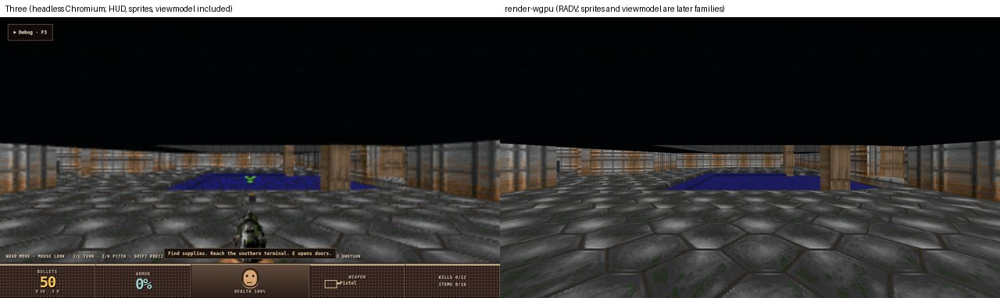
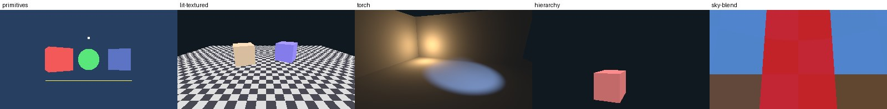

# The wgpu renderer crate (#8783), with #8815

`rust/crates/render-wgpu` renders the retained `PresentationWorld` on wgpu 30,
to an offscreen target with RGBA readback or to a window surface. It consumes
the deltas `PresentationWorld::apply` returns; nothing is serialized, mirrored
or re-validated between the retained model and the GPU. It started from the
#8796 raw prototype ([doc: rusty-engine/wgpu-bootstrap-decision]). #8815
deleted the prototype workspace in the same change.



The room study capture from #8796 (125 static meshes, 9 materials, 25
textures, equirect sky, rusty-doom `0a881b2`) rendered through
`render-wgpu`. The Three frame on the left comes from headless Chromium.

## Public surface

No wgpu type appears in it.

| Item | Purpose |
|---|---|
| `Gpu::headless()` / `Gpu::for_window(window, w, h)` | Adapter and device. Selection follows `WGPU_BACKEND`, `WGPU_ADAPTER_NAME` and `WGPU_POWER_PREF`. `for_window` takes any `raw-window-handle` window (winit) and returns a compatible `WindowSurface`. |
| `Renderer::new(&gpu, RendererOptions)` | `default_world_lights` is `RustyEngineProductDefaultWorldLights`. |
| `Renderer::apply(&RenderFrameDiff, &dyn ResourceSource) -> Vec<ApplyIssue>` | Applies one `PresentationWorld` delta. A fresh renderer applies `world.snapshot().frame` first. Ops it cannot realize come back as issues, and rendering continues. |
| `Renderer::render_offscreen(&camera, &OffscreenTarget) -> FrameStats` | Renders one `RendererCompositionCamera` view. |
| `Renderer::render_to_surface(&camera, &mut WindowSurface)` | The same, presented to the window. `PresentSkip` reports a lost or occluded swapchain. |
| `OffscreenTarget::{new, resize, read_rgba, read_rgba_into}` | sRGB RGBA8 colour, depth, and blocking readback of tightly packed rows. This is the input for #8786. |
| `ResourceSource` | Content-addressed bytes (`texture-resource/…`, mesh resources) that the runtime already admitted. |
| `encode_png` / `decode_png_rgba` | Screenshots. |

## Resource-table layout

This is what the family lanes extend. It is documented in `src/tables.rs` and
was posted on #8783.

| Table | Key | Row |
|---|---|---|
| `textures` | texture id | view and sampler; filter and wrap per descriptor; sRGB or linear per payload |
| `materials` | material id | descriptor and bind group (roughness, alpha cutoff, flags, texture) |
| `static_meshes` | asset id | interleaved vertex (pos, normal, uv) and index buffers, groups, default slots |
| `payload_meshes` | node handle | buffers of a primitive's replaced payload, or a line |
| `nodes` | `RenderHandle` | parent, children, local and world `Mat4`, own and effective visibility, root layer, kind, owned parts |
| `parts` | dense `PartId` | one drawable (node, mesh group, material ref) and its GPU row (model, normal matrix, linear colour, emission) |
| `atlases` | atlas id | retained descriptor, for #8787 |
| `environment` | — | default clear, background colour, or equirect sky with blend |

The pass pipeline runs as fixed functions in `src/frame.rs`:

1. **Propagate dirty nodes.** Only subtrees whose transform, visibility or
   parent changed are recomputed.
2. **Rebuild light rows.** Only when a light changed.
3. **Upload part rows.** Only dirty rows are written, coalesced into
   contiguous writes.
4. **Build the draw list.** Opaque parts, then lines, then blended parts back
   to front.
5. **Encode the passes.** Sky, then world.
6. **Present or read back.**

The hierarchy test asserts that cost scales with change: moving a parent
re-uploads only its two children's rows.

The owner's "must not grow" list is met. There is no scheduler, plugin
registration, query layer or change detection beyond dirty marks. Descriptors
wait in node rows only until a family realizes their kind.

## First family and parity items

Realized:
- **Nodes and hierarchy.** Transforms follow the parent. Visibility inherits.
  Children draw in their root's layer. Destroy removes the whole subtree, as
  `PresentationWorld` does.
- **Primitive nodes.** Unlit, as Three's `MeshBasicMaterial`: cube, radius-0.5
  sphere, quad, line, and point.
- **Replaced payloads.** Bound by `voxel-material/<slot>`, falling back to
  Three's golden-angle slot colour.
- **Static meshes.** Inline and resource sources. Resource streams are read by
  offset with no rehash.
- **Materials.** Colour × tint, texture, roughness, emission, mask and blend
  alpha, double-sided. `SetMaterialInstanceParameters` overrides tint and
  emission per slot.
- **Textures.** PNG, sRGB or linear, nearest/linear filtering, clamp/repeat
  wrapping.
- **Background.** `SetBackgroundColor`. With nothing selected, the Engine
  default 0x101820.
- **Camera.** One composition camera, perspective or orthographic, pose or
  explicit basis.

Parity checklist seed, all four realized:
1. Hemisphere light (sky white, ground 0x263238, 2.4) plus key light (2.2 from
   (5, 8, 6)), unless disabled.
2. Equirect sky with blend: one shader, two samples.
3. Per-texture sampler modes.
4. No shadows and no tone mapping.

Retained lights, per `docs/lighting-and-sky.md`:
- ambient, directional, point and spot;
- Three's physical falloff, `1/max(d^decay, 0.01)` with a smooth range window;
- spot penumbra `smoothstep(cos outer, cos(outer·(1−penumbra)))`;
- placed through the node hierarchy.

Shading matches `MeshStandardMaterial` with metalness 0: Lambert diffuse plus
GGX specular (F0 0.04), with Three's roughness floor and geometry roughness.

**Not realized here**, reported as `ApplyIssue` or left to the named lane:

| Item | Where it goes |
|---|---|
| Animated meshes, `SetParentJoint`, playback and inspection | #8788 |
| Voxel objects and voxel surface materials | #8784 |
| Shadows requested by `shadowIntent` | #8784 |
| Sprites and billboards (atlases are retained) | #8787 |
| The viewmodel layer, which Three draws in its own camera pass | #8785 |
| `SharedBuffer` mesh sources | Not realized: no Rust producer emits them. #8819 decided to delete the variant with #8792's contract cleanup. |
| Wireframe primitives | Realized by #8819 |
| Vertex colours | not a gap: Three's generic materials never enabled them |
| An `Update` material on a static mesh instance (retained by `PresentationWorld`) | Reported as an `ApplyIssue` (#8819): no producer sends one |

**Named differences on the room study.** The sprites and weapon viewmodel are
missing (#8787 and #8785), as is the HUD, which is DOM UI. There is no
MSAA here; Three rendered with antialiasing. #8819 has since added 4× MSAA to primary targets.

## Enforced boundary

`scripts/dependency_boundary_check.py` gives `render-wgpu` sole ownership of
`wgpu`, `wgpu-core`, `wgpu-hal`, `wgpu-types` and `naga`.
`scripts/test_architecture_checks.py` has a case for it. A doctored metadata
file in which `render-presentation` depends on wgpu fails with
`render-presentation depends on wgpu, which only render-wgpu may depend on`.

## Screenshot harness



`cargo test -p render-wgpu --test screenshots` runs seven tests. Each builds a
scene, applies it through `PresentationWorld::apply`, renders it at 320×180
and compares it with `tests/screenshots/*.png`:
- primitives over a background colour;
- textured static meshes under the neutral rig, with instance parameters;
- a torch room with the rig disabled (point, spot and ambient lights);
- hierarchy moves, hide and destroy, with the upload counts asserted;
- an equirect sky blend;
- resize and readback;
- blend order across face culling (review fix): two overlapping half-transparent
  panels keep their back-to-front order when only the farther one becomes
  double-sided. Before the fix the centre pixel went from `[188, 21, 139]` to
  `[138, 21, 188]`, because each blend pipeline sorted separately.

- **Tolerance.** A pixel differs when a channel is off by more than 12. A scene
  fails above 0.2% differing pixels.
- **Across adapters.** References blessed on llvmpipe differ from RADV on at
  most 0.002% of pixels, with a mean difference of 0.1 on the room study.
- **A regression fails.** A key light lowered from 2.2 to 1.7 fails
  `lit-textured` at 1.19%.
- **Blessing.** `RENDER_WGPU_BLESS=1` rewrites the references. A failure writes
  the actual frame to `target/render-wgpu-screenshots/`.
- **CI adapter: software Vulkan.** `verify.yml` installs
  `mesa-vulkan-drivers libvulkan1` and sets `WGPU_BACKEND=vulkan`. No GPU runner
  is needed.
- **Captured scenes.** `scripts/capture-presentation.py` records a running
  product's fresh-attachment baseline (moved here from the #8796 prototype, and
  now covering mesh resources too).
  `cargo run -p render-wgpu --example render_capture -- <dir> <out.png>`
  renders it without Chromium.

## Surface presentation: evidence limit

`WindowSurface` and `render_to_surface` compile. `examples/present_window.rs`
(winit) shows the calls #8790 makes. The example was **not run**: this machine
has no headless display server. The only one is the owner's Xwayland desktop
session, and a test window would open on the owner's screen. The desktop lane
exercises it.

## Baseline measure: files touched per visual capability (Three lane)

These are recent capability commits. Generated browser bundles, fixtures and
evidence are excluded.

| Capability (commit) | Rust src (test) | TypeScript src (test) | C# | Layers touched |
|---|---|---|---|---|
| Camera background colour (`2f34ef03b`) | 7 (1) | 4 (3) | 0 | Rust: render-model, render-presentation, csharp-engine-abi (3 files including the generated identity), csharp-engine-services (2). TS: render-contracts (types, validation), render-projection mirror, renderer-three |
| Sky panorama blend (`c30c1ef18`, sky part) | 7 (1) | 5 (1) | fixture | Rust: render-model, render-presentation, abi (3), services (2). TS: render-contracts (2), render-projection, renderer-three (`sky-blend.ts`, `three-renderer.ts`) |
| Viewport-relative sprites (`c1bcbeb75`, sprite part) | 8 (1) | 7 (3) | 2 | Rust: render-model, render-projection (2), abi (3), services (2). TS: browser main, render-contracts (2), render-projection, renderer-three (3 files: surface, view composition, renderer) |

**Summary.** About 7–8 Rust files and 4–7 hand-mirrored TypeScript files per
capability, crossing 7–9 layers.

On the wgpu path, the same background colour capability is two `render-wgpu`
functions (`apply.rs` routing and `frame.rs` clear), and it has no TypeScript.
The four TypeScript layers (contract types, contract validation, projection
mirror, Three realizer) have no counterpart. #8792 records the closing
measure.

## Reproduce

```bash
cargo test -p render-wgpu
cargo clippy -p render-wgpu --no-deps --all-targets -- -D warnings
python3 scripts/dependency_boundary_check.py && python3 scripts/test_architecture_checks.py
WGPU_BACKEND=vulkan VK_ICD_FILENAMES=/usr/share/vulkan/icd.d/lvp_icd.json cargo test -p render-wgpu --test screenshots
python3 rust/crates/render-wgpu/scripts/capture-presentation.py http://127.0.0.1:4395   # a running room study
cargo run -p render-wgpu --example render_capture -- target/render-wgpu-capture room.png
```

`cargo clippy -p render-wgpu` without `--no-deps` stops on the pre-existing
`render-presentation` lints tracked by #8757.
