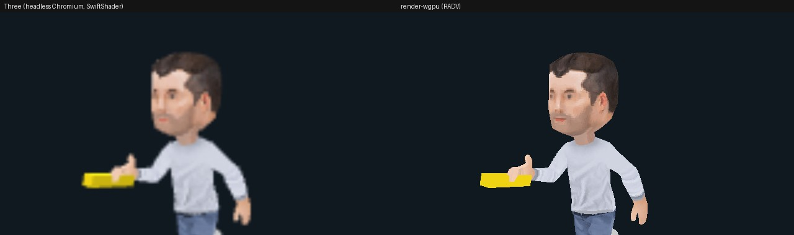
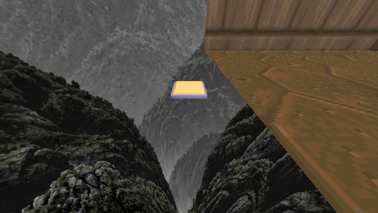

# Animated meshes, joint attachments, inspection and picking in render-wgpu (#8788, part 1)

This first landing of #8788 realizes, in `render-wgpu`:
- animated-mesh GLBs;
- skinning;
- playback on the Engine timeline;
- joint attachments;
- completion and bounds facts;
- output pose captures;
- picking.

It replaces `animated-mesh.ts`, `mesh-inspection.ts`'s bounds, and the Three
raycast pick. Ghost plates, animation controllers (the `animation`
presentation domain) and the telemetry overlay decision follow in part 2.

## Doom bone attachment beside Three



**Setup.** `rusty-doom/tools/attachment-example` on its pair
`0.1.0-dev.feec788503fe` (`--runtime ~/.cache/rusty-engine/pairs/…`):
- a skinned character (Kenney retro character, 3 clips) sampled at `run` 50%;
- a weapon GLB published as a child with `MeshJointAttachment(child, "RightHand")`;
- local scale 0.01 in the joint's space.

Captured with `capture-presentation.py` and rendered with `render_capture`.

**Result.** 0 skipped ops.
- Mean brightness over the figure is 146.2 in Three and 147.3 in wgpu.
- 1.4% of all pixels differ by more than 12, all at edges; Three has MSAA
  (#8819).
- The weapon sits in the same hand at the same angle.

## Doom E1M1 exit button



Doom ships one animated mesh, the exit button. Its capture now applies with
0 skipped ops; #8784's evidence skipped this `defineAnimatedMesh`. The
button:
- is a rigid node animation (translation, rotation and scale channels, no
  skin);
- is sampled at `toggle-off` 100%;
- uses an embedded PNG in the admitted GLB.

The camera was placed at the button for this frame. The player's start view
in #8784's capture doesn't reach it, so there is no Three frame from this
angle.

The Dagger weapon swing the task names is a viewmodel **sprite**
(`PrivateersHoldAppearance.CreateViewmodel`), not an animated mesh. Its
"completion receipts" (#8722) are Engine-side `AdvanceSpritePlayback`
receipts. Both belong to #8787's sprites, not to this renderer family.

## Fixtures (`tests/animated.rs`)

The tracked `fixtures/csharp-joint-attachments` GLBs are admitted through
`asset-import` exactly as the runtime admits them. Five tests:
- **`animated-attachment` screenshot.** The sampled pose plus the hand-held
  weapon. After the first frame, an unchanged sample at a later Engine time
  uploads nothing.
- **Repeat playback.** It moves only when the Engine time moves: two renders
  at one time are pixel-identical. Advancing the time rewrites the body's and
  the attached weapon's rows.
- **Once playback.** A `once` clip reports `NaturalCompletion { object_id,
  generation, clip }` exactly once, at the first pose past its end, then
  holds with no uploads. A changed `bounds_request` reports the posed,
  skinned world bounds.
- **Output capture with a pose.** A `RenderOutput` image job with `pose`
  samples the requested clip time in the isolated renderer. It is
  deterministic, and two times differ. #8785 refused this until now.
- **Picking.** A viewport ray through a body pixel hits the body (handle,
  source entity, distance). A handle filter restricts the hit to the weapon.

All render-wgpu tests pass on RADV and llvmpipe.

## How it works

**GLB decode (`glb.rs`).**
- It reads the admitted bytes (`animated-mesh-resource/<hash>`, and
  `clip-pack-resource/<hash>` for packs) with the workspace `gltf` crate:
  - the node hierarchy with rest TRS;
  - triangle primitives: position, normal, uv0, `COLOR_0`, `JOINTS_0` and
    `WEIGHTS_0`, with weights normalized as Three's `normalizeSkinWeights`
    does;
  - skins with inverse binds;
  - clips: translation, rotation and scale channels with step, linear
    (slerp) or cubic-spline interpolation, clamped to their end keys;
  - PBR materials (base colour and texture, metallic, roughness, emissive ×
    `KHR_materials_emissive_strength`, alpha mode, double-sided,
    `KHR_materials_unlit`) with embedded PNG textures.
- Descriptor clips bind to GLB animations by name. Clip-pack channels bind by
  node name.

**Playback (`animated.rs`).**
- Poses advance on the Engine presentation timeline the host passes with
  `Renderer::set_animation_time` (`PresentationWorld::elapsed_seconds()`, new
  in `render-presentation`), never on display time.
- Direct playback reuses `render_model::AnimatedMeshPlaybackTimeline`. A fresh
  renderer given the baseline's snapshot command therefore lands on the same
  pose.
- Loop modes: `once` clamps, `repeat` wraps, `pingPong` reflects.
- A `fadeSeconds` play from another clip cross-fades both weights linearly;
  a faded stop fades out to the rest pose.
- `samplePose` blends up to four weighted clips.
- Blending follows Three's mixer: the first contribution per property, then
  `w / (Σw + w)` mixes (slerp for rotations), then toward rest when Σw < 1.

**Cost.**
- A pose is re-evaluated only when it can change: while a clip plays or
  fades, or after a command, and only when the Engine time moved.
- Unskinned GLB nodes upload their geometry once per asset and move by a
  per-part local matrix, so they batch across instances.
- Skinned primitives are CPU-skinned (`Σ wᵢ·(jointᵢ·inverseBindᵢ)`) into the
  instance's own vertex buffer.
- A held pose costs nothing per frame.

**Joint attachments.** A child with `SetParentJoint` hangs from the posed
joint, `parent.world · joint · child.local`, and is re-derived whenever the
pose changes. An unknown or ambiguous joint is reported as an `ApplyIssue`.

**Facts.** `Renderer::take_animation_facts()` returns `NaturalCompletion` and
`MeshInspection` (posed bounds) facts. They are keyed by source entity and a
per-entity realization generation, as the Three lane's feedback facts were.
The host forwards them to the runtime's existing animation feedback route; the
host wiring is #8786/#8790.

**Inspection.**
- Posed bounds are realized.
- `matte` is realized: roughness-1, metalness-0 variants of the bound
  materials.
- `wireframe` is reported as unrealized (#8819).
- `wholeVoxelNormals` is reported as unrealized. No product sets it.

**Picking (`pick.rs`).** `Renderer::pick(&RendererPickRequest, camera, width,
height)` answers the existing contract against the backend's retained parts:
- shown parts, filtered by handle, label, tag or layer;
- AABB rejection, then triangles at the current world transform and pose;
- single-sided faces hit only from the front, as Three's raycaster was;
- lines not picked.

Retained meshes keep their positions and indices for this. No live-debug or
spatial route queried the Three renderer (spatial inspection uses Engine
collision), so the host exposes this where the webview host's `pick` went.

**Materials.** GLB metalness is now part of the material uniform and the
shared lighting function. It was `pad` before; Engine materials stay at
metalness 0.

## Not carried over

- **Morph targets and morph weight channels.** Three loaded them. No admitted
  product asset uses them.
- **`KHR_texture_transform` offsets and scales.** Doom's button declares it
  with only `texCoord: 0`.
- **The GLB rig fingerprint re-check, clip-pack channel policy checks, the
  vertex budget and the sampled-bounds plausibility diagnostics.** The
  runtime admits assets (`asset-import`, `render-model`); the renderer
  decodes and poses them.
- **Frustum-culling exemption for skinned meshes.** Skinned parts cull with
  their current posed bounds.
- **Sample readouts (`AnimatedMeshSampleReadout`).** They were the TS editor
  and inspection surfaces' own API; the posed bounds fact carries the
  product-visible part.

## Reproduce

```bash
cargo test -p render-wgpu --test animated
# in rusty-doom/tools/attachment-example
DOTNET_ROOT=/home/agent/.dotnet rusty dev --project ./AttachmentExample.csproj --port 4399 \
  --runtime ~/.cache/rusty-engine/pairs/0.1.0-dev.feec788503fe/runtime-pack
python3 rust/crates/render-wgpu/scripts/capture-presentation.py http://127.0.0.1:4399 target/attach
cargo run -p render-wgpu --example render_capture -- target/attach attach.png
```

`capture-presentation.py` now also fetches every identity in the binding's
`rendererResources`, which is where animated-mesh GLBs are named.
