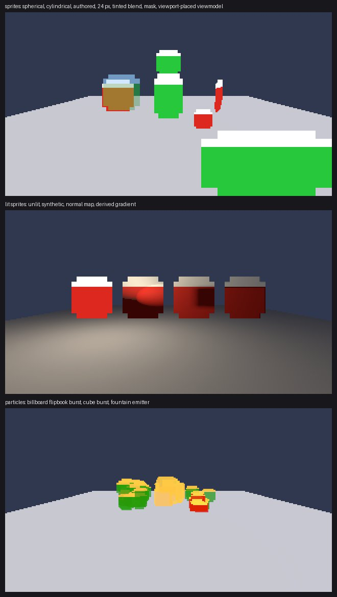
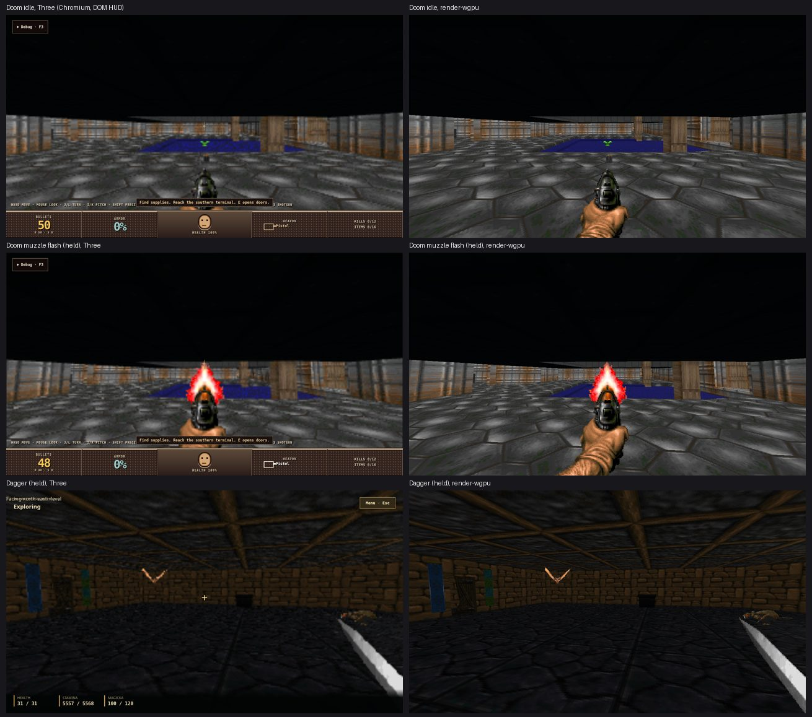

# Sprites, billboards and particles in wgpu (#8787)

`render-wgpu` now draws retained sprites and `PresentationOp::Particle`
emitters. It replaces:
- `renderer-three/src/sprite-material.ts`;
- `particle-sink.ts`;
- the sprite billboard realization in `three-renderer.ts`
  (`prepareSpritesForCamera`, pixel size, viewport placement, atlas UVs);
- the browser particle simulation in `renderer-host/src/particle-host.ts`.

The Three lane is untouched, and no downstream change is needed.

Billboard *labels* (`PresentationOp::Billboard`: text, value, icon and
structured meters) are the DOM host's, not a Three realization. By owner
decision (2026-09-29) they are rendered by `render-wgpu` in their own task,
**#8827**. Until then `apply_presentation` reports them as issues.





## Public surface

| Item | Purpose |
|---|---|
| `Renderer::apply` | Unchanged. `CreateSprite`, `UpdateSprite` and atlases were already retained by #8783; they now draw. |
| `Renderer::apply_presentation(&PresentationFrameDiff, &dyn ResourceSource, entities)` | Applies particle ops: emit, create, update and destroy. `entities` resolves entity-attached anchors; the runtime passes `PresentationWorld::entity_world_position`. Other domains come back as issues naming their task: billboard labels #8827, ghost plates and animation #8788, telemetry. Audio and video are not renderer ops. |
| `Renderer::advance_effects(seconds, entities)` | Ages particles by Engine update time. |
| `Renderer::particle_counts()` | Live particles and retained emitters. |
| `EntityPositions` | `&dyn Fn(u64) -> Option<[f32; 3]>` |

## How it works

The code is in `src/effects.rs`, `src/effects.wgsl` and `src/particles.rs`.

### Sprites

Sprites are retained nodes with transforms, visibility and the root's layer.
Their quads depend on the camera, so each view pass builds one instance row
per visible sprite from the node's propagated world matrix. There is no
parent walk.
- **Billboard modes.**
  - `spherical` takes the camera's orientation;
  - `cylindrical` takes a yaw toward the camera (the camera direction for an
    orthographic camera, the authored yaw when directly above);
  - `none` keeps the node's world matrix.
- **Pixel size.** It scales the quad by world units per pixel at the sprite's
  depth. A sprite behind the camera plane is skipped for that pass.
- **Viewport placement** (`contain` / `stretch`, alignment). The renderer owns
  the screen rectangle and draws it at mid depth, where Three unprojected it.
- **Atlas frames.** Top-left image UVs. A frame's own `size` overrides the
  descriptor size. Pivots follow Three.
- **Tint, alpha and depth.** Tint is linear. Alpha modes follow
  `sprite-material.ts`:
  - `opaque` and `mask` write depth, and blend only when tint alpha < 1;
  - `blend` never writes depth;
  - `depthTestOff` and `depthWriteOff` map to pipeline state.

  Every sprite is double-sided.
- **Lighting modes.** Unlit, plus the lit modes on the shared
  `standard_radiance` (roughness 0.82) with the pass's lights:
  - `synthetic`: Three's dome normal over the atlas UVs;
  - `authoredNormal`: a tangent-space normal map, framed with
    `perturbNormal2Arb`;
  - `authoredDepth` and `derivedGradient`: a bump map from the depth
    texture or the colour texture (`perturbNormalArb`).
- **Draw order in a view pass.**
  1. world opaque parts;
  2. solid sprites, by render order, then front to back;
  3. world blended parts;
  4. blended sprites, by render order, then back to front;
  5. particles.
- **Viewmodel layer.** Its sprites draw in the viewmodel pass (#8785), which
  is where the Doom weapon and its flash live.
- **Playback.** It stays where it was: the Engine advances sprite playback on
  update time and publishes `UpdateSprite { frame }`. The renderer shows
  the retained frame, so held time freezes playback structurally.

### Particles

`particles.rs` ports the browser host's rules:
- seeded xorshift32, so the same seed gives the same burst;
- continuous emitters spawn by rate with carry;
- bursts per `Emit`, each its own emitter that ends with its last particle;
- lifetime and velocity ranges, and acceleration;
- plane and AABB collision with restitution, friction, an impact limit
  (sleep or kill) and sleep speed;
- size and colour curves, and the flipbook frame.

Particles age only in `advance_effects`, and no clock is read. The fixture
advances 0 s and gets a pixel-identical frame, then advances 50 ms and gets a
different one.

**Drawing.** Billboards are screen-aligned quads of `size × 24` pixels,
Three's `gl_PointSize` (constant on screen), with a horizontal flipbook strip
and nearest sampling. Cubes are the builtin unit cube per instance, depth
writing and blended.

**Colour.** Curve colours are sRGB-encoded as Three wrote them straight to the
canvas, and are converted to linear here.

**Allocation.** Particles live in one dense `Vec`. Row, order and cube
buffers are scratch reused across passes. Per frame there is no allocation
per particle: grouping uses integer texture ids and each particle's
descriptor `Arc`.

**Textures.** A particle sprite texture is loaded once per content hash, from
`texture-resource/<hash>` or the retained texture of the same id.

**Caps.** There is no host-wide cap: the browser host's 4,096 budget is gone
with #8798, and each emitter's `max_particles` is the only bound. Particle and
sprite instance buffers grow by doubling.

**Stale targets.** Offscreen composition targets (#8785) go stale when
particles advance, not while held. A fixture asserts it.

## Named differences

| Item | Here | Why |
|---|---|---|
| Blended sprites against blended world parts | Sorted within each group, not across | Three sorted every transparent object together. Interleaved blended sprites and blended meshes at mixed depths may order differently. |
| Pixel-sized sprites | Target pixels | Three used CSS pixels; they differ only when the device pixel ratio isn't 1. |
| Sprite `shadow` policy | Not realized | There are no shadows in the backend; shadows are #8784. |
| Fog on sprites | None | The wgpu backend has no fog. |
| Particle diagnostics readout (`ParticleProjectionReadout`) | `particle_counts()` and `ApplyIssue`s | Nothing reads the old readout outside the browser host. |

## Evidence

**Fixtures.** `cargo test -p render-wgpu --test effects` runs four tests; the
references were blessed on llvmpipe and pass on RADV.
- **`sprites`.** Every billboard mode, pixel size, a tinted blend over
  another sprite, a mask, and a viewport-placed viewmodel sprite. It also
  asserts that a render without a delta is identical, and that an
  `UpdateSprite` frame change alters it.
- **`sprites-lit`.** Unlit, synthetic, normal map and derived gradient, under
  a point light and ambient light with the neutral rig disabled.
- **`particles`.** A billboard flipbook burst, a cube burst and a fountain
  emitter, after 0.3 s of Engine time. It asserts:
  - the held burst is frozen: 0 s advanced, identical frame;
  - Engine time moves it again;
  - bursts end, and the retained emitter remains.
- **Stale targets.** Particles leave an offscreen target current while held,
  and make it stale once advanced.

`particles.rs` unit tests cover:
- seeding and aging on Engine time only;
- emitter rate and its `max_particles` bound;
- entity anchors through the resolver;
- plane collision coming to rest.

**Products: held frames, Three beside render-wgpu.** Each pair is the same
held simulation state (`engine.time.mode manual`). The Three frame is a
Chromium screenshot; the wgpu frame renders the presentation baseline
captured at that moment through `render_capture`.
- **Doom idle** (room study, `rusty-doom c080e46` on its `playtest-development-20260928k` pack).
  - The armour bonus and ammo clip (cylindrical sprites) and the pistol
    viewmodel (viewport placed) sit in the same places at the same sizes.
  - Differences: Three's HUD is DOM, and Three renders with MSAA (#8819).
- **Doom muzzle flash.** Fire, then step the held world one frame at a time
  until the weapon shows `PISGB` with the `PISFA` flash (entity 35001,
  render order 1), and capture both. The flash and firing frame match in
  shape, size and position, and the pool's near edge falls on the same pixel
  row (460) in both frames.
  - This pair is also the Doom viewmodel evidence #8785 asked for.
- **Dagger, Privateer's Hold** (current pair `a44170f62`, held).
  - The bat and rat actor sprites and the sword viewmodel match.
  - Dagger disables the world rig (`defaultLights.world: disabled`).
    Rendered with `render_capture --no-default-world-lights` (this change adds
    `--no-default-viewmodel-lights` beside it), the 173 retained lights light
    the room as in Three.

**Dagger ranged flight: not captured.** The arrow in flight is a static mesh
(`CreateStaticMeshFromContent`), not a sprite or particle, and its per-flight
material update is the static-mesh override gap in #8819. The starting
character also carries no bow, so no ranged release happened in the held
session. The flight's family is the world family (#8783, #8819).

**Particles in products.** Doom and Dagger emit none; CraftSurvive and the
Engine's `csharp-particle-emission` fixture do. The particle evidence here is
the fixtures.

## Reproduce

```bash
WGPU_BACKEND=vulkan cargo test -p render-wgpu --test effects
# Doom room study with live debug, then the held pair (see scripts/):
DOTNET_ROOT=/home/agent/.dotnet LOADING_BAY_PORT=4396 bash scripts/run-room-study.sh   # in rusty-doom
node docs/evidence/render-wgpu-effects-8787/scripts/doom-held-pair.mjs http://127.0.0.1:4396 <out> rust/crates/render-wgpu/scripts/capture-presentation.py
cargo run -p render-wgpu --example render_capture -- <out>/fire-4 fire.png 1280 720
# Dagger: rusty dev --project ./src/WorldRpg.Host/WorldRpg.Host.csproj --port 4397 --live-debug,
# then dagger-ui-intent.py <origin> begin cinematic-skip cinematic-skip cinematic-skip,
# dagger-held-pair.mjs, and render with --no-default-world-lights.
```

After rebasing over #8784 (shadows, batching, voxels), the Doom fire frame and
the Dagger frame render pixel-identical to the images above.

## Checks

| Check | Result |
|---|---|
| `cargo test -p render-wgpu` | 12 unit, 6 `screenshots`, 6 `scene` (#8784), 5 `views`, 4 `effects`; passes on RADV and llvmpipe |
| `cargo clippy -p render-wgpu --no-deps --all-targets -- -D warnings` | clean |
| `cargo fmt` | clean |

## Wiring for the host lanes

- **#8786 and #8790.** Call `apply_presentation` with each presentation delta
  alongside `apply`. Call `advance_effects` with the same Engine update
  seconds the runtime passes to `PresentationWorld::advance_elapsed`; while
  the simulation is held it passes none.
- **#8827.** Billboard labels.
