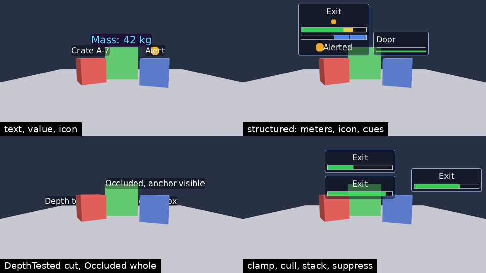
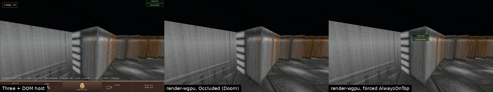

# render-wgpu billboard labels (#8827)

`PresentationOp::Billboard` labels now render in `render-wgpu`, in place of
renderer-host's DOM billboard host (`billboard-host.ts`, which #8792
deletes). Text, value, icon and structured labels draw in every primary view.
Their depth layers now use the view's real depth buffer.





## Mechanism (`src/labels.rs`, `src/labels.wgsl`)

- **Apply.**
  - `apply_presentation` routes billboard ops to the label table.
    Engine Presentation's `BillboardProjector` has already admitted each op
    against the same retained set: duplicate and unknown handles, and each
    patched descriptor, are checked there, and the runtime snapshot replays
    its active set. So the renderer repeats none of those checks.
  - Updates use the model's patch rule, now public as
    `BillboardDescriptor::patched` (it was private in `render-presentation`,
    and the DOM host mirrored it).
  - What can still fail is loading a font or icon, reported as
    `fontLoadFailed` / `iconLoadFailed`. A failed label keeps its descriptor
    and draws nothing until a later update realizes it.
- **Rasterizing.**
  - Labels are rasterized on the CPU, only when something the image shows
    changes (content, font, size, colours). Each label becomes one sRGB
    texture, laid out as the DOM host's CSS laid out its element.
  - Fonts use `fontdue` (MIT/Apache-2.0/Zlib). WOFF and WOFF2 are decoded
    with `wuff` (MIT). Both are registered to `render-wgpu` in
    `EXTERNAL_DEPENDENCY_OWNERS`.
  - Every system family draws with bundled DejaVu Sans (`fonts/`, Bitstream
    Vera licence). The runtime pack now ships that licence under
    `share/third-party/dejavu-sans/`.
  - `BillboardFontRef::Asset` loads from the resource source by asset
    identity.
  - Icons are the admitted texture's resource bytes (`texture-resource/<hash>`,
    as for particle textures).
- **Per frame.**
  - Each primary view projects the anchors with its own camera. It then
    applies the DOM host's visibility rules and structured layout policy, and
    draws screen-space quads, far to near.
  - Anchor-only, visibility, distance and layer updates reuse the texture.
    Doom updates its indicator every frame: an unchanged update costs 0.4 µs,
    while a meter change re-rasterizes in 0.28 ms (release, 180×75 indicator).
- **Layers.**
  - `DepthTested` and `Occluded` draw after the world pass, before the
    viewmodel pass clears depth. The scene's depth is attached read-only.
  - `DepthTested` compares each pixel of the quad at the anchor's depth, so a
    label running behind a nearer object is cut by it.
  - `Occluded` hides the whole label when the scene covers its anchor pixel.
    The vertex shader samples the depth texture there, so no readback is
    needed. An anchor outside the view has no depth to test and is not hidden.
  - `AlwaysOnTop` draws after the viewmodel.
  - Primary depth targets gained `TEXTURE_BINDING` for this.
- **Not drawn into.** Output captures and offscreen composition targets draw
  no labels, as the DOM overlay never reached them.

## As the DOM host did

- **Content.**
  - Font size is `height_pixels` and the line height is 1.2.
  - Text, value and icon labels are one nowrap line on the background with a
    4px radius. Value text reads `label: value unit`.
  - An icon label draws its image behind its alternative text, contained and
    centred, as the CSS background did.
- **Structured indicators.** These are a border-box flex column of
  `width_pixels` with a 1px border, `spacing_pixels` padding and gap,
  alignment, radius, backing and whole-image opacity. The items, in order:
  - the label;
  - the icon, at its natural size;
  - the meters: 0.5em plus border, back under the border, preview and fill
    by direction, and segment dividers at `rgba(0,0,0,0.72)`. A meter
    overflows the content box by its border on each side, as `width: 100%`
    with a content-box border did. Measured in the Doom frame, the DOM meter
    is 168 px wide inside a 180 px indicator;
  - the status cues, each text with its icon contained at the left.
- **Localization.** The fallback text is drawn, with `{name}` arguments
  substituted. That is the DOM host's default localizer, and the application
  host never passed another, so no product localization table exists on
  either side.
- **Visibility.** A label is hidden when:
  - `visible` is false;
  - it is farther than `max_distance`;
  - it is a plain label whose anchor is outside the view;
  - its entity anchor is unknown.
- **Layout policy.**
  - Order is priority, then handle, with at most 256 structured labels.
  - Sizing is constant or distance-scaled, within the safe area.
  - Edges clamp or cull, and overlaps stack or suppress.
  - Placement keeps a 0.5px / 0.005 scale hysteresis. The row-count height
    estimate is used for placement.
  - The label is scaled about its centre, as
    `translate(-50%, -100%) scale(s)` did.
  - In the Doom frame the wgpu indicator is 135 px wide at scale 0.75, as in
    the browser.
- **Entity anchors** resolve on apply and on every `advance_effects`, from
  `PresentationWorld::entity_world_position`.

## Named differences

- **Font face.** DejaVu Sans stands in for the browser's `sans-serif`, and
  there is no system font lookup.
- **Text blending and position.**
  - Glyph edges blend over the scene in linear space; the browser blended in
    sRGB.
  - Unscaled labels land on whole pixels, not subpixel positions.
- **Pixels.** CSS pixels are drawn as target pixels, with no device pixel
  ratio. (#8853 adds the ratio: labels rasterize and lay out at the
  output's device pixel ratio.)
- **Depth layers are real.** In the DOM host both depth layers always showed
  (`occluded: false`; there was no depth readback).
- **Placement follows the camera.** In the browser, the Doom indicator stayed
  at (1137, −3) at yaw −180°, −96° and 46°, even though its anchor moves across
  the view. Two causes:
  - renderer-three's `projectWorldPoint` projects with the surface's
    controls camera, which Doom's C# view composition does not move;
  - the application host never calls the DOM host's per-frame `advance`.

  render-wgpu projects with each view's camera every frame.
- **Anchor kinds.** The task named scene-node anchors, but the model has only
  `World` and `EntityAttached`, and both are realized.
- **Glyph atlas.** The task suggested one. Instead, each label is one texture
  holding its whole CSS box (background, border, meters, icons and text), and
  it is rasterized only when its image changes. An atlas would pay off only
  for text that changes every frame, which no producer sends.

## Doom E1M1 exit indicator

Doom's `LoadingBayExitPresentation` publishes a structured indicator with the
`Occluded` layer and distance scaling.

- **Setup.** Doom (`rusty-doom e21b385`) ran on the current Engine pair
  `f1d747afc01c` with `LOADING_BAY_SCENE=legacy-voxel`. The player turned with
  held `L` to yaw 46°, facing the exit, which is behind walls. Doom's own
  readout says "Exit occluded".
- **Capture.** The browser frame comes from headless Chromium
  (`scripts/doom-exit-indicator.mjs`). At the same moment,
  `capture-presentation.py` saved the fresh-attachment baseline. It now also
  writes `presentation.json`, which `render_capture` applies.
- **Result.**
  - **Browser (left).** The DOM label sits clamped at the top right, where it
    was first placed.
  - **render-wgpu with `Occluded` (centre).** The wall covers the anchor, so
    the label is hidden. That agrees with the product's perception.
  - **Same frame, layer forced to `AlwaysOnTop` (right).** The label is
    placed above the exit, behind the wall.

## Tests (`tests/labels.rs`, references blessed on llvmpipe)

- `text_value_and_icon_labels_draw_above_their_anchors`: template arguments,
  value and unit, an icon behind its alternative text (`labels-content.png`).
- `structured_indicators_draw_meters_icons_and_cues`: preview fill, segments,
  right-to-left and bottom-to-top meters, icon, cue icon, start and centre
  alignment (`labels-structured.png`).
- `layers_follow_the_scene_depth`:
  - behind a box, an `Occluded` label changes no pixel;
  - so does a `DepthTested` one that the box fully covers;
  - `AlwaysOnTop` draws;
  - a long depth-tested label is cut by the nearer boxes, while an occluded
    one with a visible anchor draws whole (`labels-layers.png`).
- `structured_layout_clamps_culls_stacks_and_suppresses`: nothing reaches the
  left safe band or crosses the right one (`labels-layout.png`).
- `distance_scaled_indicators_shrink_with_distance`.
- `visibility_distance_and_destroy_hide_labels`: each hidden frame equals the
  label-free frame byte for byte.
- `entity_anchors_follow_their_entity`: the label crosses sides with its
  entity and hides when the entity is gone.
- `asset_fonts_load_from_resources`.
- `a_label_whose_font_fails_to_load_is_realized_by_a_later_update`.
- `a_content_patch_to_text_drops_the_structured_layout`.

`cargo test -p render-wgpu` passes on RADV and on llvmpipe. Clippy
(`--no-deps --all-targets -D warnings`) and the dependency boundary check
pass.

## Reproduce

```bash
cargo test -p render-wgpu --test labels
WGPU_BACKEND=vulkan VK_ICD_FILENAMES=/usr/share/vulkan/icd.d/lvp_icd.json cargo test -p render-wgpu
python3 rust/crates/render-wgpu/scripts/capture-presentation.py http://127.0.0.1:4396 target/doom-labels
cargo run --release -p render-wgpu --example render_capture -- target/doom-labels doom.png
```

Start Doom with `LOADING_BAY_SCENE=legacy-voxel LOADING_BAY_LIVE_DEBUG=1
LOADING_BAY_PORT=4396 scripts/run-csharp-product.sh`. Then run
`node scripts/doom-exit-indicator.mjs http://127.0.0.1:4396/ out.png l 900`
to turn (yaw grows about 130° per second of `L`) and take the browser frame.
