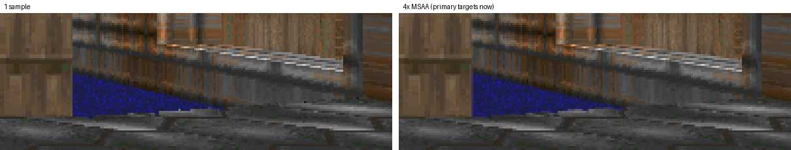
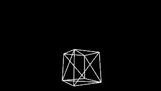

# render-wgpu parity gaps no family owned (#8819)

Four gaps #8783 named. Two are realized (antialiasing, wireframe) and two are
decided (the static-mesh view material, shared-buffer meshes).

## 1. Antialiasing: 4× MSAA on the primary destination



Three created its canvas with `antialias: true` (`browser-surface.ts`). Its
render targets and captures had no samples. render-wgpu now matches that:

- **Which targets.** `OffscreenTarget` (the primary target, including the
  streaming readback) and `WindowSurface` draw into 4× multisampled colour and
  depth. Every pass resolves into the single-sample colour that readback
  copies, or into the swapchain image. Composition offscreen targets, output
  captures and ghost-plate captures stay single-sample, as Three's
  `WebGLRenderTarget`s were. Output captures keep their own supersampling.
- **Pipelines.** Every pipeline cache is keyed by `ColorTarget { format,
  samples }` instead of the format alone: world, sky, sprites, particles,
  ghost-plate draws, viewport clears and presentation blits. `TargetView`
  carries the sample count and the resolve view. `PRIMARY_SAMPLES` in
  `target.rs` is the one switch, and 1 works.
- **Cost.** Measured with `render_capture --frames=200` on the room study at
  1280×720, including readback, on a shared machine:

  | Adapter | 1 sample | 4× MSAA |
  |---|---|---|
  | RADV (RX 9070 XT) | 0.97–1.14 ms | 1.40–1.52 ms |
  | llvmpipe (software) | 17.5 ms | 53.4 ms |

  About half a millisecond per frame on the GPU the runtime needs, so a
  post-process AA was not worth its differences: FXAA-style filters also
  soften the nearest-filtered Doom textures, which Three's MSAA did not.
  llvmpipe triples, but it is the CI adapter at small fixture sizes.

## 2. Wireframe



- **Surface.** `Material.wireframe` is public C# API
  (`PrimitiveAppearanceRequest.Wireframe`), so it is realized, not removed.
- **Primitives.** A wireframe cube, sphere or quad draws every triangle's
  three edges, as Three's wireframe `MeshBasicMaterial` did. Back edges show,
  because face culling does not apply to lines.
- **Replaced payloads.** A primitive's replaced payload takes the node's view
  material's `wireframe` too, as Three applied the view material to uploaded
  meshes.
- **Animated inspection.** Inspection `wireframe` now outlines the posed
  animated mesh (#8788 had reported it as unrealized). Three's mesh
  inspection cloned the materials with `wireframe`.
- **Mechanism.**
  - A part has a `wireframe` flag, which is also part of its batch key.
  - Its mesh builds a line-list edge buffer on first use (`GpuMesh.edges`,
    from the CPU indices it already keeps for picking).
  - The part draws through the lines pipeline, over the doubled index
    range. Picking still hits the triangles, as Three's raycast did.

## 3. `Update { material }` on a static mesh: reported

- **No producer.** No Engine producer sends a view material to anything but
  a primitive. The appearance projector (`render-projection/src/appearance.rs`,
  `append_node_updates`) sends `material: None` for static meshes, animated
  meshes and sprites. It turns a material change on those into a
  recreation: `UpdateStaticMeshMaterials` changes slot overrides, which
  recreate the instance with the new bindings.
- **Dagger's arrow is not a gap.** #8787's evidence had filed it under this
  item, but its material update is exactly that recreation, which render-wgpu
  realizes.
- **What Three did.** Three's `#update` would have replaced every slot of such
  a node, textures included, with one flat `MeshBasicMaterial` colour. That is
  not a behaviour to reproduce.
- **What render-wgpu does.** It still realizes view materials on primitives.
  For any other kind it returns an `ApplyIssue` and applies the rest of the
  update (transform, visibility), so a future producer cannot be silently
  ignored.
- **Retention.** `PresentationWorld`'s `material_override` retention is left
  as it is. For primitives it duplicates what `Create` carries. Removing it
  is a renderer-neutral model change, and it gains nothing here.

## 4. `MeshPayloadSource::SharedBuffer`: delete with #8792

No Rust producer emits it. Only the TypeScript contracts and the Three
renderer's browser buffer provider know it, and #8792 deletes both. The
decision is to delete the variant from `render-model` in #8792's contract
cleanup; this is recorded on #8792. Until then render-wgpu reports it as
unrealized.

## Tests

- `primary_targets_antialias_triangle_edges`: a black unlit cube on white
  leaves more than 100 partially covered pixels. Single-sampled, every pixel
  would be exactly black or white.
- `wireframe_primitives_draw_their_triangle_edges`: the wireframe cube lights
  less than half the pixels of the solid one, plus a reference image.
- `view_materials_on_static_meshes_are_reported_and_the_rest_applies`: one
  `update` issue, and the visibility in the same op still hides the mesh.
- `inspection_wireframe_outlines_the_posed_character`: the outline changes
  more than 1,000 pixels, and clearing inspection restores the solid body
  byte for byte.
- **References.** Every reference the MSAA edges moved was re-blessed on
  llvmpipe: 16 images, plus the new `wireframe.png`. `capture.png` differed
  by at most one level and was kept.
  - Triangle scenes pass on RADV within the default 0.2%.
  - The two scenes that draw lines (`primitives`, `wireframe`) compare
    within 1%. Vulkan lets implementations rasterize multisampled lines
    differently, and llvmpipe and RADV disagree along them (0.27% and
    0.40%).
- **Full suite.** `cargo test -p render-wgpu` passes on RADV and on llvmpipe.

## Reproduce

```bash
cargo test -p render-wgpu
WGPU_BACKEND=vulkan VK_ICD_FILENAMES=/usr/share/vulkan/icd.d/lvp_icd.json cargo test -p render-wgpu
cargo run --release -p render-wgpu --example render_capture -- target/render-wgpu-capture room.png --frames=200
```
