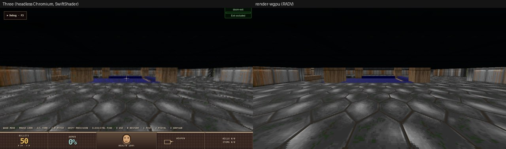
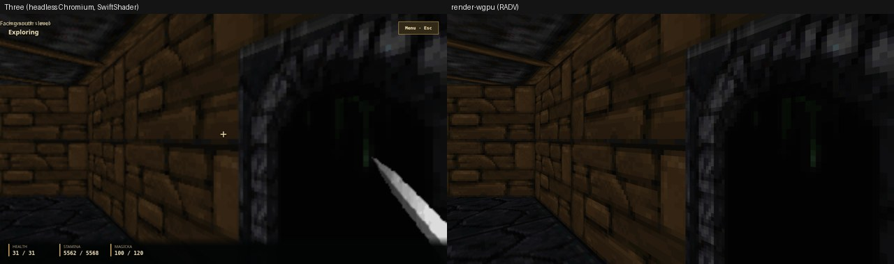
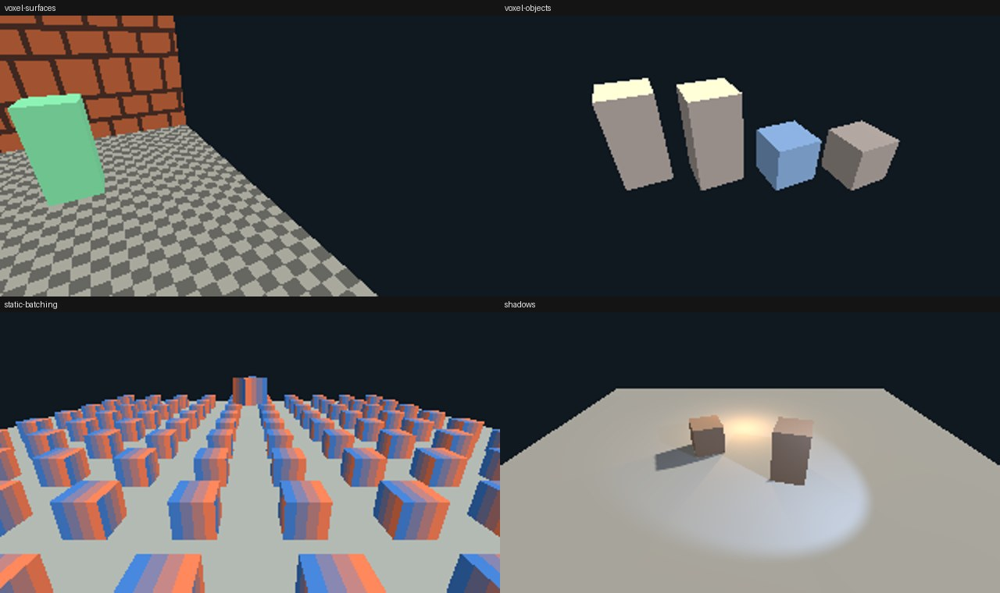

# Scene families in render-wgpu (#8784)

`render-wgpu` now realizes the world families Doom E1M1 and Dagger depend on:
- batched and culled static and voxel object instances;
- voxel scene chunk surfaces with repeat and atlas mapping;
- voxel objects and their frames;
- static mesh vertex colours;
- requested shadows (directional, spot, point).

It replaces what `renderer-three` did in `uploaded-mesh-batching.ts`,
`voxel-surface-material.ts`, `lighting.ts`, `sky-blend.ts` and
`static-room.ts`, plus the batching, voxel and shadow code in
`three-renderer.ts` those files served. Sky blend, sampler modes and the light
formulas were already realized by #8783; this task adds shadows to the same
light rows.

Downstream: no change. Doom and Dagger captures below render through the
unchanged retained model.

## Doom E1M1 (voxel scene, `LOADING_BAY_SCENE=legacy-voxel`)



**Capture.** rusty-doom `0a881b2` (its working tree had other lanes'
uncommitted edits) on its pinned pack `playtest-development-20260928k`.

**What it contains.** 194 chunk payloads and 49 voxel surface materials, all
`repeat`, plus 50 textures and an equirect sky.

**Result.** It renders with one skipped op: the exit button's
`defineAnimatedMesh`, which is #8788.
- 2,721 parts; 1,331 draws after culling.
- Mean brightness above the HUD is 37.8 in both renderers. Mean absolute
  difference is 3.4 per channel; 10% of pixels differ by more than 12.
- Those pixels are edges and distant texels.

**Named differences:**
- no MSAA; Three rendered with `antialias: true` (#8819);
- the HUD is DOM UI, not the renderer;
- the exit button is not drawn (#8788).

The dark band above the walls is E1M1's ceiling geometry in both renderers,
not a missing sky.

## Dagger dungeon (Privateer's Hold)



**Capture.** rusty-dagger `a481531` on its pinned pair `0.1.0-dev.db2bb445aeaa`,
driven into `playing` with its own `dagger.ui` intents: `begin`, then three
`cinematic-skip`.

**What it contains.** 65 static mesh instances, 173 retained point and ambient
lights, 169 textures and 4,882 materials. It uses
`defaultLights.world = disabled`, so render with
`render_capture … --no-default-world-lights`.

**Result.** 0 skipped ops.
- Mean brightness over the left half (outside the weapon) is 23.5 in both
  renderers. Mean absolute difference is 1.7 per channel.

**Named differences:**
- the weapon viewmodel sprite (#8787 sprites, drawn in #8785's viewmodel pass);
- the HUD is DOM UI;
- no MSAA (#8819).

## Screenshot fixtures (`tests/scene.rs`)



`cargo test -p render-wgpu --test scene` has six tests. They use the same
tolerance and blessing as `tests/screenshots.rs`, and the harness lives in
`tests/support/`. The references were blessed on RADV and pass on llvmpipe.

- **`voxel-surfaces`.** A real engine-spatial GreedyCubes scene, projected by
  `render-projection`'s `VoxelRenderProjector` into 8³ chunks.
  - Materials: a repeat-mapped checker (2-cell tiles), an atlas-mapped brick
    region with a magenta 1-texel padding that half-texel inset sampling never
    reaches, and a flat material.
  - Clearing one cell republishes one chunk.
  - The renderer uploads exactly that chunk's group rows.
- **`voxel-objects`.** A two-mesh, three-frame voxel object.
  - Frames that share a mesh batch together; a material override splits its
    instance off.
  - `SetVoxelObjectFrame` rebinds three parts and uploads no geometry.
- **`static-batching`.** 100 crates and a mirrored crate.
  - The crates draw as one instanced batch, culled to the view.
  - The mirrored crate draws through a clockwise-front pipeline and still faces
    out.
  - An unchanged frame uploads no part rows and no instance ids.
  - Moving one crate uploads one row.
  - Turning the camera re-culls.
- **`shadows`.** Directional, spot and point lights with requested shadows take
  8 layers (1 + 1 + 6).
  - Camera motion alone re-renders no shadow map.
  - A newly created crate casts on the next frame with no per-object setup.
- **Shadows off.** Without `RendererOptions::shadows`, the same lights allocate
  no layers.
- **Vertex colours.** Vertex colours multiply a static mesh's material. The
  same colours on an uploaded payload are ignored, as in Three.

The existing `hierarchy` and `lit-textured` tests now also assert batching:
- same mesh and material means one draw;
- `SetMaterialInstanceParameters` lives in the part row and does not split a
  batch.

## What moved and how

**Instancing (`batch.rs`).** Every part's row is already in the dense `parts`
storage buffer, so a batch is a run of part ids in an `instances` buffer drawn
by one `draw_indexed`.
- **Batch key.** Mesh, index range and material, interned and reference
  counted in `Parts`.
- **Blended parts** stay one draw each, back to front, as Three kept alpha
  groups separate.
- **Culling.** Per part, against the view frustum, with a world AABB that
  `Parts::write` refreshes.
- **Uploads.** Each view layer (world, viewmodel) keeps its last draw list. The
  list is rebuilt only when its camera or any part changed, and re-uploaded
  only when the drawn set differs.

**Voxel objects (`voxel.rs`).**
- `DefineVoxelObject` uploads each mesh once.
- An instance draws its frame's mesh with the asset's slot materials and its
  own overrides.
- Redefinition and release rebind live instances.

**Voxel surfaces.** Chunk UVs are tile coordinates in cells. A material with a
`voxelSurface` remaps them in the shader:
`uv = mix(min, max, fract((uv - origin) / scale))`.
- Atlas regions use Three's half-texel inset in top-left texture space.
- The voxel surface's own alpha policy replaces the material's.
- The material uniform grew from 16 to 48 bytes for this; the layout change was
  posted on #8783 first.

**Shadows (`shadows.rs`, `shadow.wgsl`).**
- **Layers.** One depth-array layer per directional or spot light, six per
  point light. There is no quota.
- **Casters and receivers.** Every shown scene part casts and every lit part
  receives, so nothing is initialized per object.
- **When maps render.** Only when a light or part changed.
- **Parameters: Three's defaults**, which the Three lane never changed:
  - 512² maps, bias 0;
  - back faces of single-sided parts;
  - directional: from the light object's `(0, 1, 0)` over a ±5 orthographic box,
    near 0.5, far 500;
  - spot: over twice the cone angle;
  - point: over six 90° faces;
  - far = range, or 500 without one.
- **Sampling.** Receivers take 3×3 PCF over linear comparisons.

**Vertex colours.** Static meshes multiply their RGBA vertex colours into the
base colour, as Three's `vertexColors` did for static meshes only. Payload and
voxel object meshes ignore theirs. The #8783 note that Three never enabled
vertex colours was wrong for static meshes.

## Removed or not carried over

- **Dynamically parented statics kept out of batches (#8730).** Not ported.
  Three copied `matrixWorld` into instance buffers, so a member under a moving
  joint or billboard went stale. Here a batch only names part rows, so a moving
  parent rewrites its children's rows and no batch changes.
- **Batching switched off whenever shadows are on.** Not ported. Three
  excluded `castShadow` meshes from batches; here the caster pass draws the
  same batches.
- **Three's batch rules.** The 4,096-member cap, the 2-member minimum and the
  negative-determinant exclusion are gone.
- **Per-object `castShadow`/`receiveShadow` flags and their initialization.**
  Gone; see Shadows above.
- **`UploadedMaterialPool` reference counting and `consolidateUploadedGroups`.**
  Not needed: retained materials are already one bind group per id, and group
  ranges draw as they arrive.
- **Voxel surface re-validation of texture id, version, hash and sampler.**
  Not ported. `render-model` validates the descriptor, and the texture binds by
  id.
- **`static-room.ts`.** A Three fixture; the Rust fixtures replace it.

## Limits

- **Directional shadow coverage.** It follows Three's default: only the ±5 box
  around the light object's position. In the shadow fixture the right-hand
  crate lies behind that camera's near plane and casts no directional shadow,
  as it would not in Three. No product requests shadows, and C# product hosts
  do not enable them (Three's `lighting.shadows.enabled` never reached C#
  products). A camera-fitted cascade waits for a consumer.
- **Voxel chunks don't batch.** Each chunk is its own mesh, so chunks draw one
  call per material group. E1M1 is 1,331 draws.
- **Several world views in one frame.** They share the world layer's cached
  list, so each re-culls. A single primary view (world then viewmodel) reuses
  both lists.
- **Surface presentation** was not exercised; see #8783's evidence limit.

## Files touched per visual capability (tracked measure)

Voxel surface mapping on the wgpu path touched 3 files in 1 crate:
`voxel.rs` (resolve), `apply.rs` (material uniform) and `world.wgsl`, with
the same remap in `shadow.wgsl` for mask casters. There is no TypeScript and no
contract mirror. The Three lane's baseline (#8783) is 7–8 Rust and 4–7
TypeScript files across 7–9 layers.

## Reproduce

```bash
cargo test -p render-wgpu
WGPU_BACKEND=vulkan VK_ICD_FILENAMES=/usr/share/vulkan/icd.d/lvp_icd.json cargo test -p render-wgpu
cargo clippy -p render-wgpu --no-deps --all-targets -- -D warnings
# Doom E1M1: in rusty-doom
DOTNET_ROOT=/home/agent/.dotnet LOADING_BAY_PORT=4397 LOADING_BAY_SCENE=legacy-voxel bash scripts/run-csharp-product.sh
python3 rust/crates/render-wgpu/scripts/capture-presentation.py http://127.0.0.1:4397 target/doom-e1m1
cargo run -p render-wgpu --example render_capture -- target/doom-e1m1 doom.png
# Dagger: rusty dev --project ./src/WorldRpg.Host/WorldRpg.Host.csproj --port 4398,
# send dagger.ui begin + 3× cinematic-skip, then capture and render with
cargo run -p render-wgpu --example render_capture -- target/dagger dagger.png 1280 720 --no-default-world-lights
```

`capture-presentation.py` now also reads the whole-batch baselines that newer
hosts send (Dagger's pair), not only fragmented transfers.
