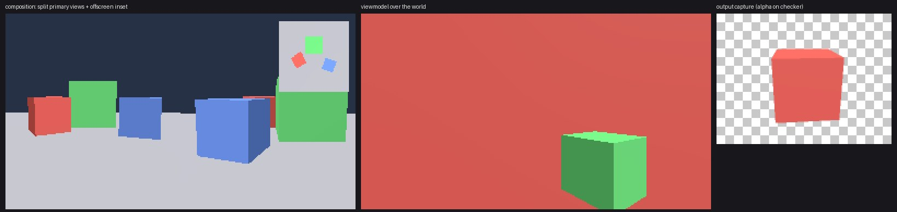
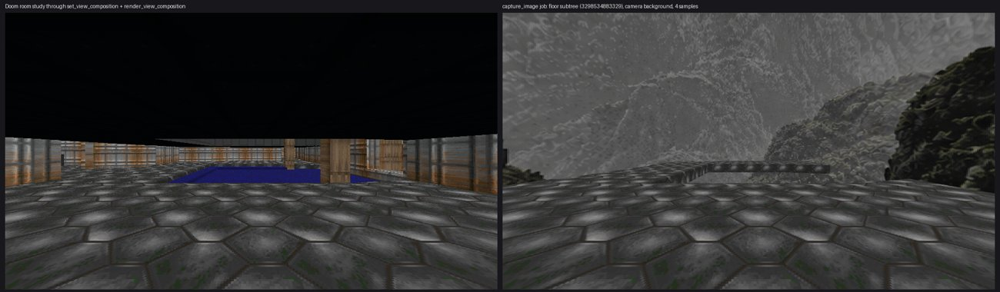

# Camera composition, viewmodel, multi-view and captures in wgpu (#8785)

`render-wgpu` now realizes the committed camera composition that the C#
`CameraView` service publishes (`RuntimePublication::ViewComposition`):
- primary and offscreen views;
- presentations of offscreen targets;
- the viewmodel camera pass;
- camera motion between samples;
- output image jobs (`RenderOutput.CaptureImage`).

It replaces these files in `renderer-three`:
- `view-composition.ts`;
- `viewmodel-camera.ts`;
- `camera-motion.ts`;
- `camera-pose.ts`;
- `render-output.ts` (image capture only; GLB stays, see below);
- `browser-surface-render-pass.ts`.

The Three lane itself is untouched (frozen), and there is no downstream change.





## Public surface

| Item | Purpose |
|---|---|
| `Renderer::set_view_composition(&RendererViewComposition, time_seconds)` | Installs the committed composition. `time_seconds` is the presentation time it arrived at. |
| `Renderer::render_view_composition(&OffscreenTarget, time_seconds) -> FrameStats` | Renders every view, the viewmodel passes and the presentations at presentation time `time_seconds`. |
| `Renderer::render_view_composition_to_surface(&mut WindowSurface, time_seconds)` | The same, presented to a window. |
| `Renderer::view_composition_readout() -> ViewCompositionReadout` | For the presentation observation: renderer-local revision, frame count, target status (`NeverRendered`/`Stale`/`Current`) with the last refreshed frame, and camera motion samples. |
| `Renderer::capture_image(&RenderOutputJob, &dyn ResourceSource) -> Result<Vec<u8>, String>` | Runs an image output job. Returns the PNG, or the diagnostic that fails the job. |
| `RendererOptions::default_viewmodel_lights` | `RustyEngineProductDefaultViewmodelLights`. |
| `FrameStats::offscreen_views` | Offscreen views drawn this frame. |

`render_offscreen` and `render_to_surface` remain, as one camera over the
whole target. They now include the viewmodel pass.

## How it works

The code is in `src/camera.rs`, `src/composition.rs`, `src/capture.rs`,
`src/compose.rs` and `src/compose.wgsl`. Each frame runs in this order:

1. **Offscreen views**, by `(order, id)`, grouped by target. A target is
   drawn only when it is stale:
   - it has never been drawn;
   - a new composition was installed;
   - a delta was applied since (the renderer's scene generation);
   - or one of its view cameras moved.

   A current target is presented as it was drawn. The first fixture asserts
   `offscreen_views` of 1, then 0 with no change, then 1 after a delta.
2. **Primary steps**, by `(order, id)`, views and presentations
   interleaved:
   - **A view** clears its viewport and draws the world once. It then clears
     depth and draws the viewmodel layer.
   - **A presentation** draws the target into its destination viewport with
     the target's sampling mode.

   Viewports are normalized and bottom-left based, as the SDK documents.
   Primary area that no view covers keeps the environment clear.
3. **No fallback world pass (#8728).** A frame with no primary view is only
   the clear, and the fixture asserts 0 draws.

**Viewmodel.** Viewmodel-layer nodes are camera-local. They draw from a camera
at the origin looking down −Z, with the world camera's projection and the
viewport's aspect, as `synchronizeCameraRelativeViewmodelCamera` did.
- **Lighting.** Three lit the viewmodel scene separately, and so does this:
  - the viewmodel rig (hemisphere, plus the key at (2, 3, 2)) unless
    disabled;
  - retained lights in the viewmodel layer.
- **World lights.** They no longer include viewmodel-layer lights.
- **Where the rows go.** Both sets share the lights buffer, world rows then
  viewmodel rows. The frame uniform's spare `counts.y` gives the first row.

**Camera motion.** It is the `camera-motion.ts` rules, ported:
- sample history up to 64;
- position or pose interpolation;
- reset on a cut, a clock discontinuity, or a changed delay or mode;
- a repeated sample id is ignored.

The one change is the clock: the host passes the presentation time, and the
backend reads no wall clock.

**Held time (#8718).** A held simulation publishes no new samples, so the
cursor reaches the latest sample and stays there however far the
presentation clock runs. The fixture renders at t = 0.15 (exactly halfway)
and at t = 60 (the last pose), each pixel-identical to a still camera at
that pose.

**Captures.** An image job builds an isolated renderer from the job's frozen
frame. That frame is the source subtree with ancestor transforms, from
`PresentationWorld::capture_output_scene`. The steps:
1. **Render.** The world, then the viewmodel, into an `Rgba16Float` target
   cleared to the job's linear background. With `use_camera_background` and
   a retained background, the environment clear and sky are drawn instead.
2. **Convert.** A pass resolves, un-premultiplies, applies exposure or ACES
   filmic (Three's curve) and writes straight alpha to sRGB RGBA8.
3. **Encode.** Read back and write a PNG.

The live tables are untouched; the fixture compares `table_counts` before and
after.

## Capture interface for ghost plates (#8788)

These are crate-internal, in `src/capture.rs`:
- **`Renderer::isolated(&frame, &resources) -> (Renderer, Vec<ApplyIssue>)`**:
  a renderer holding only a frozen frame, with the same device and options.
  It is the counterpart of `createIsolatedCaptureScene`.
- **`Renderer::capture(&CaptureRequest) -> Capture`** renders one camera
  (a `CameraPose` plus a projection) at any size and colour format. The
  request's `background` is `Clear(linear RGBA)` or `Environment`, and it
  says whether to draw the viewmodel. The capture returns sampleable colour
  and `Depth32Float` depth textures. A ghost pass can resolve linear depth,
  coverage or normals from them.

Two things are not in it yet, and #8788 adds them:
- a lighting override for `GhostPlateCaptureLightingMode::Isolated` (a field
  on `CaptureRequest`);
- a normal-pass material.

## Named differences and limits

| Item | Here | Why |
|---|---|---|
| `samples` > 1 on a capture | Ordered-grid supersampling: ceil(√samples)² texels per pixel, resolved in linear light before tone mapping | Pipelines have no MSAA yet (#8819). A size × factor over the device texture limit fails with a diagnostic. |
| Capture with a nonzero `PoseObjectId` | Fails with a diagnostic naming #8788 | Deterministic animated pose sampling belongs to animated meshes. |
| GLB export | Stays with the browser output executor (`capture_image` refuses a GLB job) | The task keeps GLB where it is; #8826 moves it into Rust. |
| `RendererTargetDepth::None` | The target still gets a depth buffer | Every view pass depth-tests. Drawing in submission order is not a product need. |
| Stale target revisions, atomic receipts, the terminal-surface state | Removed | The runtime validated the composition. A target reallocates when its descriptor or revision changes, and a view naming a missing camera or target draws nothing. |
| Observer camera (`setObserver`) | Not realized | It belongs to #8719 (codex); it would be one more pose source here. |
| Readout `Stale` | Reflects compositions and deltas | Camera motion is checked at render time, not at readout. |

## Doom viewmodel: moved to #8787

The Doom weapon is a viewport-placed sprite in the viewmodel layer
(`createSprite` with `layer: viewmodel` and `viewportPlacement`). Sprites are
#8787, the next task in this lane. The viewmodel pass is proven here by the
fixture, and the Doom weapon capture beside Three comes with #8787's
evidence. Rifles has no viewmodel layer.

The room study above renders through the composition path. The result:
- 125 draws and no skipped ops, on RADV;
- pixel-identical to `render_offscreen` of the same camera, whose world pass
  is unchanged from #8783 (the six #8783 screenshot references still pass);
- the 30 sprites are retained, not drawn (#8787).

The capture beside it is an output image job over the floor subtree, using
the camera background and 4 samples.

## Checks

| Check | Result |
|---|---|
| `cargo test -p render-wgpu` | 4 unit tests, 6 `screenshots`, 5 `views`; passes on RADV and llvmpipe |
| `cargo clippy -p render-wgpu --no-deps --all-targets -- -D warnings` | clean |
| `cargo fmt` | clean |

New references (`composition`, `viewmodel`, `capture`) were blessed on
llvmpipe and pass on RADV, using the #8783 tolerance.

## Reproduce

```bash
WGPU_BACKEND=vulkan cargo test -p render-wgpu --test views
WGPU_BACKEND=vulkan VK_ICD_FILENAMES=/usr/share/vulkan/icd.d/lvp_icd.json cargo test -p render-wgpu
python3 rust/crates/render-wgpu/scripts/capture-presentation.py http://127.0.0.1:4395 target/render-wgpu-capture
cargo run -p render-wgpu --example render_capture -- target/render-wgpu-capture room.png 960 540 3298534883329 capture.png
```

## Not wired yet

The runtime does not own a `Renderer` yet. Two lanes wire this surface in:
- **#8786 (streaming)** and **#8790 (desktop)** call
  `set_view_composition` on each `ViewComposition` publication, and
  `render_view_composition*` each tick with the host presentation clock.
- **#8826** (filed with this task) runs `RenderOutput` image jobs through
  `capture_image` with the runtime's admitted render resources. It also moves
  GLB export into Rust before #8792 deletes the browser executor.
