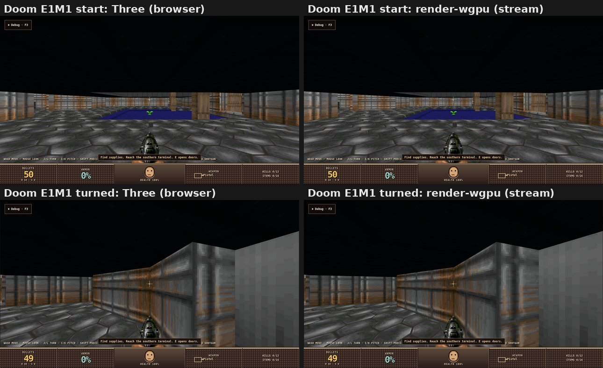
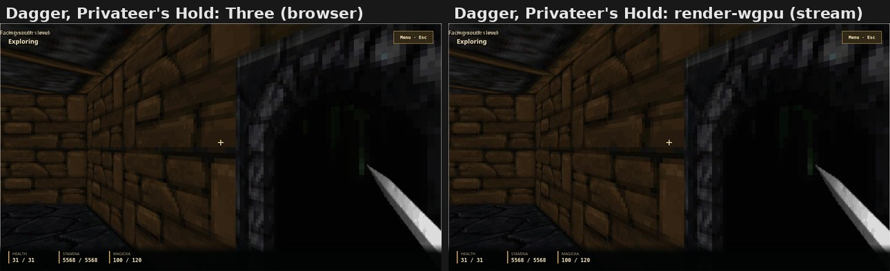
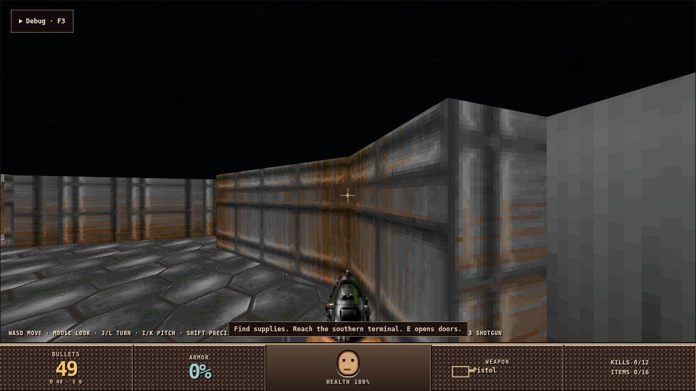
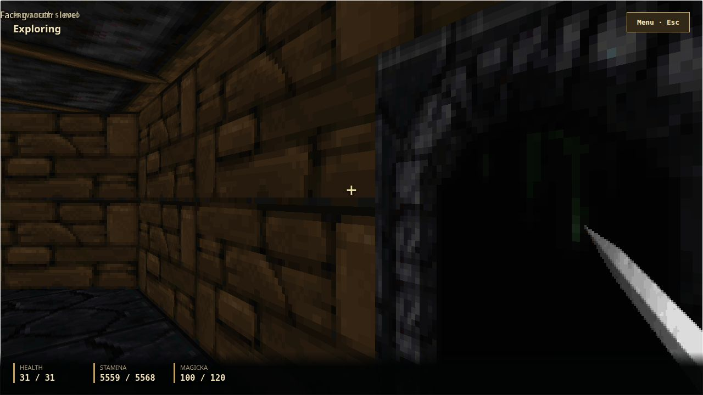
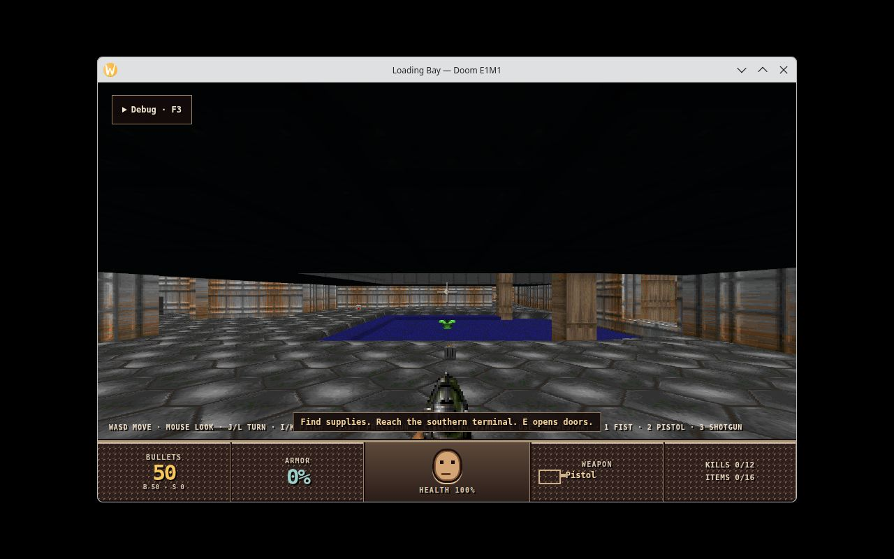
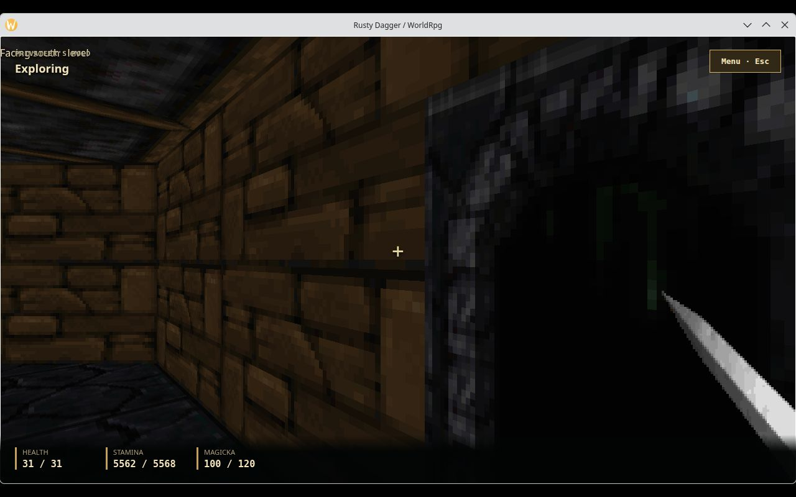

# Parity gate, then the Three.js lane deleted (#8792)

## Parity gate

### Current main, both paths, same held state

Every capture was taken from one runtime pack built at `9857de734`. Each
product ran twice on it: once on the Three browser path (no
`RUSTY_RENDER_OUTPUT`) and once on the streamed wgpu path
(`RUSTY_RENDER_OUTPUT=stream`).

`scripts/parity-capture.mjs` does the same held-time steps on both paths, so
both runs reach the same simulation state:
1. load, then `engine.time.mode manual`;
2. one step, then a screenshot;
3. click the canvas (Doom fires once), hold the turn key over 900 ms of held
   time, then a second screenshot.

Screenshots are the page as the viewer sees it, product DOM UI included.

| Frame | Mean abs. difference per channel | Pixels differing by more than 12 | Mean brightness, Three / wgpu |
|---|---|---|---|
| Doom E1M1, start | 1.6 | 0.6% | 36.4 / 36.5 |
| Doom E1M1, turned right | 1.2 | 0.2% | 43.6 / 43.8 |
| Dagger, Privateer's Hold | 1.0 | 0.0% | 20.3 / 20.2 |

- **Doom.** The runs end in the same state, with identical actor positions in
  `loading-bay.readout`. The shot left 49 bullets on both paths.
- **Differing pixels.** They are edge and distant texels: JPEG in the stream,
  and a different MSAA resolve.
- **Dagger.** It is driven into `playing` with its own `dagger.ui` intents.
  `ArrowRight` does not turn Dagger's player, so its two frames are the same
  view.

### Families

The realization children and their evidence hold the family captures.

| Family | Realized by | Side-by-side / proof | Named accepted differences |
|---|---|---|---|
| World: nodes, transforms, static meshes, materials, textures, background, sky | #8783, #8784 | [room study and fixtures](../render-wgpu-8783/README.md); [Doom E1M1 and Dagger beside Three](../render-wgpu-scene-8784/README.md); the frames above | Product HUD is DOM on both paths. Three's MSAA is matched by 4× MSAA on primary targets (#8819). |
| Instancing and voxel surfaces | #8784 | Doom `legacy-voxel` E1M1 beside Three (#8784); voxel object fixtures | Three's batch rules (4,096-member cap, 2-member minimum, no batching under shadows) not ported; members draw from one instance list per view. |
| Lighting, shadows and sky | #8784 | Dagger's 173 retained lights beside Three (#8784, #8787); sky blend fixtures | Parameters are Three's defaults; `defaultLights` honoured (`--no-default-world-lights` for Dagger). |
| Camera composition and viewmodel | #8785 | [composition fixtures](../render-wgpu-views-8785/README.md); Doom viewmodel and muzzle-flash pair (#8787) | Capture supersampling instead of single-sample captures; stale-revision receipts removed; observer camera answered by the runtime (#8841). |
| Billboards, sprites and labels | #8787, #8827, #8853 | [Doom and Dagger held frames](../render-wgpu-effects-8787/README.md); [labels beside the DOM host](../render-wgpu-labels-8827/README.md) | DejaVu Sans for `sans-serif`; linear-space glyph blending; real label depth layers; no fog or shadow on sprites. CSS pixels at the output's device pixel ratio since #8853. |
| Particles | #8787, #8851 | Effects fixtures (Doom and Dagger emit none) | Particle readout replaced by `particle_counts()` and apply issues. |
| Ghost plates | #8788, #8842 | Ghost plate fixture; runtime feedback (#8842) | Limitation mask stays the directional bank's; sector choice is Three's rule. |
| Animated meshes | #8788, #8847, #8850 | [Doom bone attachment beside Three](../render-wgpu-animated-8788/README.md); E1M1 exit button | Display-time weight interpolation between ticks not ported; cue facts not realized (no reader). |
| Telemetry overlay and inspection | #8788 (decision), #8841 | [streaming inspection](../streaming-inspection-8841/README.md); the harness run below | The telemetry overlay is DOM UI that no C# service or runtime path emits. It is deleted with `renderer-host`; see "Decisions". |
| Audio | #8789, #8812–#8814, #8821 | [device recordings](../audio-8789/README.md); Doom device audio (#8821) | kira's linear spatial falloff instead of Web Audio's inverse model; no Opus on the device before #8812. |
| Video | #8791, #8862 | [window and stream playback](../stream-video-8862/README.md) | Soundtrack not resynchronized for long clips. |

### crew-services playtest harness, stream mode

Setup:
- Doom on the same pack, with `RUSTY_RENDER_OUTPUT=stream` and
  `LOADING_BAY_LIVE_DEBUG=1`;
- the installed `playtest` service with its unchanged `rusty-doom` profile.

This follows the ordinary exercise in crew-services'
`playtest-product-integration.md`:

| Step | Result |
|---|---|
| `playtest start rusty-doom`, `assist discover` | `connected`. 17 assist operations (`discover` … `jump-plan`) and 40 native debug commands ([`01-discover.json`](crew/01-discover.json)). |
| `capture` | The streamed frame under Doom's HUD ([`crew-01-ready.jpg`](crew/crew-01-ready.jpg)). |
| `time action-driven` | `worldHeld: true`. |
| `look yaw -30`, `act forward 600ms` | Position (-7, 3) → (-8.74, -0.12): 3.6 units in held time. Held-time `act` moves the player since #8843. |
| `action attack`, `act attack` | `available: true`, equipment Pistol. The shot takes one bullet ([`crew-02-attack.jpg`](crew/crew-02-attack.jpg)). |
| Walk to the north wing door | `route` answered `NoPath` (Doom's #8865). The run steered by the route's target bearing, climbed the pool ledge with W+Space in realtime, then went back to action-driven time. |
| `interaction` | Door 20000 at 1.91 units: `focusReason: Ready`, `selected: true` ([`05-interaction.json`](crew/05-interaction.json)). |
| `act use`, `advance 1500` | Door `closed` → `open`. `interaction.inspect` reports it `Unavailable` for use; `targets` reports `door-north-wing: open` ([`06-use.json`](crew/06-use.json), [`07-after.json`](crew/07-after.json)). |
| `capture` | The opened door's corridor ([`crew-03-door-closed.jpg`](crew/crew-03-door-closed.jpg), [`crew-04-door-open.jpg`](crew/crew-04-door-open.jpg)). |

- **Presentation fields.** `capture` reports `application_renderer`,
  `engine_presentation_state` and `engine_readiness` as `unavailable`, as
  #8786 recorded. The harness reads the page's Three observation, which
  stream mode never had. The screenshots come from the streamed canvas.
- **Firing twice.** A second shot in action-driven time needs an explicit
  `advance`: `act attack` holds only its first step, so the pistol stays
  `weapon-not-ready`.
- **Exit interview.**
  - Movement, looking, the equipment action, interaction focus and door use
    all worked through ordinary input on the streamed frame.
  - Navigation guidance is unavailable because of the Doom `NoPath`
    regression (#8865). It is not a renderer matter.

### Closing measure: files touched per visual capability

The Three-lane baseline is in
[#8783](../render-wgpu-8783/README.md#baseline-measure-files-touched-per-visual-capability-three-lane):
about 7–8 Rust files and 4–7 hand-mirrored TypeScript files per capability,
crossing 7–9 layers.

Capability commits on the wgpu lane count the files they touched. Tests,
evidence, docs and generated files are left out.

| Capability (commit) | Rust | TypeScript | C# | Layers |
|---|---|---|---|---|
| Wireframe and 4× MSAA on primary targets (`a3dca59b7`) | 13 | 0 | 0 | render-model, render-wgpu |
| Labels at the output's pixel ratio (`9e44dec35`) | 7 | 1 | 0 | render-wgpu, render-stream, product-dev-host frames, desktop shell; the stream client sends its CSS width |
| Billboard labels with depth layers (`fb390b127`) | 7 | 0 | 0 | render-wgpu (plus 7 font files) |
| Video in streamed frames (`5f53ba1e1`) | 12 | 1 | 0 | render-wgpu, render-stream, frame header, runtime frame output; the stream client shows flagged frames above the UI |
| Release particle textures (`25d8f2150`) | 2 | 0 | 0 | render-wgpu |

- **Result.** A visual capability is now Rust-only, and mostly within
  `render-wgpu`.
- **TypeScript.** It appears only when the capability changes what the stream
  client shows, as a one-file change. The four TypeScript layers per
  capability are gone: contract types, contract validation, projection
  mirror and Three realizer.
- **Rust count.** It sometimes runs higher than the baseline. Those
  capabilities are larger than the baseline's one-field additions, and each
  also carries its host plumbing (stream header, desktop shell).

## Deletion

With the gate recorded, the Three.js lane is gone. `render-wgpu` is the only
renderer.

### What was removed

- **TypeScript.** Removed:
  - the packages `renderer-three`, `renderer-host`, `render-projection` and
    `render-contracts`;
  - the graphics realization paths of `application-host` and
    `product-browser-host`: renderer port, content catalog, renderer preload,
    dynamic resources, surface replacement, projection recovery, and the
    audio, video, animation, ghost plate and renderer diagnostics feedback
    reporters;
  - the browser specs and pages, the webview, product-playtest and voxel
    vignette pages, the behavior and donor inventories, the Playwright and
    Vite configs they used, and the dead product bundle template.
- **Rust.** Removed:
  - `renderer-webview-host`;
  - `MeshPayloadSource::SharedBuffer` (its validation, its error variant and
    render-wgpu's "not realized" arm);
  - the dev host's browser feedback routes (`audio-feedback`,
    `video-feedback`, `animation-feedback`, `ghost-plate-feedback`,
    `renderer-diagnostics`), with their wire types and `ProductDevRuntime`
    methods;
  - the renderer resource route and renderer preload bundle entries;
  - publication frontiers and renderer resource inventories on the wire;
  - the readout's inspection time;
  - the telemetry overlay op (`PresentationOp::TelemetryOverlay` and its
    projector). No C# service or runtime path ever emitted it, and its only
    realizer was the deleted DOM host.
- **CI and scripts.** Removed `.github/workflows/render.yml`,
  `verify-render.sh`, `verify-renderer-webview-host.sh`,
  `build-render-behavior-inventory.sh`, both voxel vignette staging scripts,
  `measure-world-indicators.sh`, `measure-voxel-chunk-updates.sh`, and the
  browser lane of `run-performance-regression.sh`.
  - `.github/workflows/browser.yml` builds and tests what remains.
  - `check-ci-routing.py` and its negative probes route `render/**` to it.
- **Fixtures.** Removed the render fixtures only the Three lane read.

### What remains in TypeScript

| Package | Role |
|---|---|
| `application-host` | Engine canvas and the frame view (streamed frames, or transparent over the desktop window), input capture and arbitration, product UI mount, UI projection |
| `product-browser-host` | Runtime transport, lifecycle and uncertain-input recovery, health reports, playtest inspection hook, runtime-pack shell page |
| `live-debug-client`, `live-debug-panel` | Developer console over the product's debug catalog |

That is 11,405 lines, 7,866 of them outside tests. `render/` held about 77k
with specs when the campaign started. Across this change, TypeScript and
JavaScript under `render/` lost 68,702 lines and gained 1,044; Rust lost 6,292
and gained 445.

### Decisions this settles

- **Stream is the default output.** `RUSTY_RENDER_OUTPUT` is `stream`
  (default) or `window`.
  - The host binary always builds a renderer.
  - `--exercise` and `--performance-probe` runs build none: they assert
    Engine behaviour and exit, so CI's C# lane needs no GPU.
  - Runtimes constructed without an output (tests) have none either.
- **Device audio is the default.** The runtime plays audio on the output
  device.
  - With `RUSTY_AUDIO_OUTPUT` unset, a machine with no device runs silent after
    one warning: its audio ops are dropped and report no completions. No
    product consumes audio completions today.
  - `RUSTY_AUDIO_OUTPUT=device` still fails the load without a device.
  - The desktop shell no longer sets the variable.
- **The telemetry overlay has no DOM home.** Nothing produced it, so the op is
  deleted rather than rehosted.
- **The page receives only its binding, baseline markers, UI projections,
  readouts and input results.** The browser shell's surviving recovery is an
  output-gap rule: after a gap, incremental outputs are ignored until the next
  fresh baseline arrives.
- **Renderer diagnostics come from the Rust renderer.** `engine.renderer`
  (`status`, `read`, `detail`) reports its statistics:
  - the adapter;
  - frames per second;
  - median render, readback and encode times;
  - bytes per frame and per second;
  - skipped ops.

  The live-debug metrics widget shows them. `Diagnostics.ReadRenderer` keeps
  its ABI and is refreshed from the same statistics once a second.
- **Pointer lock is released for menus again.** The streamed surface's
  `releaseInput` was a no-op, so an interface or modal mode, an interactive UI
  press or window blur left the pointer locked. The Three surface exited
  pointer lock in those cases, and the new application host does too.

### Measures

| | Before (`9857de734`) | After |
|---|---|---|
| Runtime pack | 412.4 MB | 385.0 MB |
| `bin/` | 220.1 MB (`rusty-product-host` 185.4 MB, `rusty-live-debug` 27.8 MB) | 206.6 MB (177.6 MB, 22.1 MB) |
| `symbols/` | 190.7 MB | 178.1 MB |
| `share/browser/` | 1.44 MB | 0.15 MB |
| Browser shell bundle | 1,409,315 bytes (three.js included) | 114,244 bytes |
| SSE bytes, 5 s from a fresh attach to Doom E1M1 in stream mode | 25.8 MB (the whole graphics baseline, then frames and view compositions) | 2.5 KB (binding, UI projection, readout) |

Both packs were built with `scripts/build-runtime-pack.sh` on this machine.

### The new pack in use

- **Doom and Dagger, no `RUSTY_RENDER_OUTPUT`.** Both streamed.
  - `parity-capture.mjs` ran unchanged: held time, the canvas click, the held
    turn and Dagger's UI intents.
  - The frames match the gate's stream captures above.
  - The product HUDs (UI projection) render.
- **Device audio.** While Doom ran, `pactl list sink-inputs` showed a
  `PipeWire ALSA [rusty-product-host]` playback stream, with the variable
  unset.
- **Harness.** A second crew-services pass on the new pack reported:
  - 17 operations and 40 native commands;
  - action-driven time;
  - `act forward 1000ms` moved 5.98 units;
  - `act attack` accepted and spent a bullet;
  - `frame` available.
- **Desktop window.** A `--desktop` pack from this tree opened Doom's window
  with the UI overlay. A virtual click and a 700 ms W hold (KWin fake input)
  moved the player 3.9 units.

### The published pair

CI published pair `0.1.0-dev.829d277f6468` from `829d277f6`, and all four
workflows passed. Doom (`55f746f`) and Dagger (`7ae8db0`) moved to it with
`rusty update`. Nothing in either product changed beyond the pin.

- **Browser (default output).** `rusty dev` ran each product from the
  installed pair. Nothing set `RUSTY_RENDER_OUTPUT`, so both streamed.
  `parity-capture.mjs` ran unchanged and recorded no page errors.
- **Desktop window.** With `RUSTY_RENDER_OUTPUT=window`, `rusty dev`
  downloaded the pair's desktop pack into `<pair>/desktop-pack` and opened
  each product's window on the headless KWin compositor. Both HUDs render in
  the overlay. Dagger entered `playing` through its own UI intents.
  `engine.renderer` answered with `output: window`.

Both products show the same view on the pair as on the locally built pack
above. The overlapping labels in Dagger's top left belong to its own UI and
already appear in the earlier capture.

### Checks

- `cargo test --workspace` passes, as do `cargo clippy --workspace
  --all-targets -D warnings` and `cargo fmt --check`.
- Desktop-feature clippy (`csharp-product-runtime/desktop`,
  `desktop-shell/web-overlay`) passes.
- `pnpm --dir render run verify` builds both bundles, confirms they are
  closed, and passes 101 tests: 32 application-host, 60 product-browser-host,
  4 live-debug-panel, 5 live-debug-client.
- These pass: `dependency_boundary_check.py` (render-model and
  render-presentation may not depend on `render-wgpu`, `render-stream` or
  `desktop-shell`), `test_architecture_checks.py`, `check-ci-routing.py`,
  `test-ci-routing-checker.sh`, and `check-doc-links.sh`.
- `pnpm install --offline` pruned `three`, `@types/three`, `fflate` and
  `@noble/hashes` from the lockfile. `@playwright/test` stays at 1.61.1 for
  `capture-playtest-warning-delta.mjs`.

### Docs

Updated:
- `docs/architecture.md`: the presentation sections now describe the wgpu
  path, runtime outputs to the browser shell, and runtime-rendered output;
- `docs/csharp-capabilities.md` (TypeScript boundary);
- `docs/recorded-audio.md` (device realization only);
- `docs/presentation-capture.md` (the runtime renderer's observation);
- `docs/performance.md`, `docs/verification.md`, `docs/desktop-shell.md`,
  `render/README.md`, and the fixture READMEs.

The Den ADR `host-platform-and-browser-validation-boundary` now states wgpu
as the renderer and the browser as a display and UI host. The "removing the
Three renderer" non-goal is gone.
