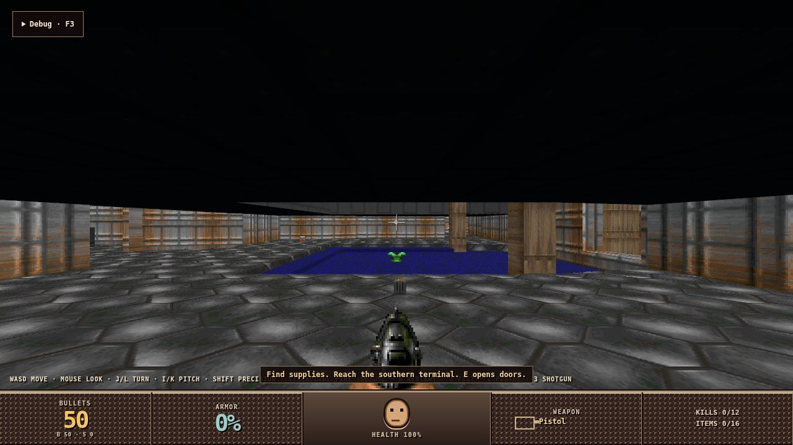

# #8793: the Rust-to-TypeScript contracts, generated from Rust

Every shape that crosses from the Rust host to the browser shell is now
declared once, in Rust. ts-rs emits them into one checked-in file per browser
package. A Rust test fails while a file is stale. The TypeScript that
restated those shapes by hand is gone, including its field-by-field decoders
and validators.

## Route

The #8764 decision (`docs/evidence/precompiled-bridge-8764/README.md`, "Second
emitter") named a serde-derived emitter, because these DTOs never cross the C
ABI. This task uses ts-rs 11.1 (`serde-json-impl`, `no-serde-warnings`), a
normal dependency of the crates that declare wire types. ts-rs reads the serde
attributes: `rename_all`, `tag`, `untagged`, `flatten`, `rename` and `skip`.
`#[ts(...)]` states the rest:
- `optional` for fields the host omits;
- `as` and `type` for hand-serialized values (canonical u64 text, literal
  artifacts);
- `rename` for wire structs whose Rust name carries `Wire`.

The generator is not a schema framework. It is
`rust/crates/product-dev-host/src/typescript.rs`, a test module of about 180
lines. It does three things:
- **Collects declarations.** For each package it walks the named root types
  and their dependencies through ts-rs's `TypeVisitor`.
- **Emits constants.** It writes out the `RSF1` header layout (`frames.rs`
  now encodes the header by named offsets) and the route paths as constants.
- **Checks or writes.** It compares the rendered file with the checked-in one,
  or writes it with `RUSTY_WRITE_TYPESCRIPT_CONTRACTS=1`
  (`scripts/generate-typescript-contracts.sh`).

Each file is self-contained. A type two packages share, like the runtime
binding, is declared in both files. Both are generated, so they cannot drift.

## What crosses, and where it is declared

| Shape | Rust declaration | Emitted to |
|---|---|---|
| Input envelopes, facts, intent claims, control catalogs | `runtime-input` `RuntimeInputWire*`, `KeyboardControl`, `PointerButton`, `ControllerButton`, `ControllerAxis` | application-host, product-browser-host |
| UI projection envelope | `runtime-ui` `RuntimeUiProjectionWire` (TS name `RuntimeUiProjectionEnvelope`) | application-host, product-browser-host |
| Render output, cursor mode | `product-dev-host` `ProductDevRenderOutput`, `ProductDevCursorMode` | application-host, product-browser-host |
| `RSF1` frame header, frame route | `product-dev-host` `frames.rs` (`header::*`, `FLAG_*`, `ProductDevFrameFormat`) | application-host |
| Runtime outputs (SSE `data`) | `ProductDevRuntimeOutputWire` (TS `ProductDevRuntimeOutput`; `complete-baseline` skipped: the host consumes it) | product-browser-host |
| Connection baseline (`rusty-output-baseline`) | `ProductDevConnectionBaseline` (new) | product-browser-host |
| Operation, input and timeline results; runtime readout | `ProductDevOperationResult`, `ProductDevInputResult`, `ProductDevTimelineCompletionResult`, `ProductDevRuntimeReadout` | product-browser-host |
| Request bodies | `ProductDev{Empty,Lifecycle,Control,Input,Realtime,External}Request`, `ProductDevTimelineCompletionWire`, `ProductDevBrowserDiagnosticsReport` | product-browser-host |
| Product bootstrap (`product-bootstrap.json`) | `ProductDevBrowserBootstrap` (moved from `csharp-product-runtime`) | product-browser-host |
| Engine live-debug answers | `ProductDevRendererInspection`, `ProductDevTimeAnswer` (new, `engine_debug.rs`) | product-browser-host |
| Debug catalog | `ProductDevDebugCatalog` | product-browser-host, live-debug-client |
| Diagnostics read, telemetry, update attribution | `ProductDevDiagnosticsReadRequest/Response`, `RuntimeDiagnosticsBatch`, `RuntimeDiagnosticEvent`, `ProductDevTelemetrySnapshot`, `ProductDevUpdateAttribution*` | live-debug-client |
| Renderer status (`engine.renderer.*`) | `ProductDevRendererStatus`, `ProductDevRendererStatistics`, `ProductDevStreamStatistics` (new) | live-debug-client |
| Host error body | `ProductDevErrorResponse` (new) | live-debug-client |

Product-owned debug answers (`playtest.*`, `spatial.*`, `navigation.*`) come
from C# and are not Engine contracts.

## What the TypeScript lost

- **`local-transport.ts`: 2,044 → 1,055 lines.**
  - Every `decode*`, `snapshot*` and `require*` helper is gone, along with the
    closed-catalog sets (keyboard controls, buttons, axes, clear reasons,
    fault dispositions) and the `ProductBrowserWireRecord` field list.
  - Responses and SSE events are read as their generated types.
  - Requests are typed with the generated request shapes.
  - Behavior stays unchanged: the commit-disposition headers, output cursors,
    fresh-baseline recovery and reconnection.
- **`input-ingress.ts`: 1,166 → 776 lines.**
  - The hand-declared input unions are gone, along with the fact, intent,
    identity and u64 validators and the plain-JSON walker.
  - A claimed product payload is copied with `structuredClone`: it is sent
    later, and the product's later edits must not reach it.
- **`ui-projection.ts`.** The field-by-field envelope validation is gone. It
  keeps stream and contract selection, the runtime epoch, sequence ordering
  and the subscriber bound, and freezes the value every subscriber shares.
- **`live-debug-client`: 481 → 102 lines.** The decoders are gone. The dead
  `diagnosticRendererObservationAgeMilliseconds` goes too: nothing has emitted
  `renderer-observation-age-ms` since #8792.
- **The runtime-pack shell.** `runtime-pack-shell/main.js` went from 68 lines
  to 10. It calls `startProductBrowserShell`, a typed function in
  product-browser-host that reads `ProductDevBrowserBootstrap`.
- **Hand-mirrored unions.** Render output, cursor mode, lifecycle mode and
  operation kind are gone. The playtest adapter's time and drawing mode lists
  now `satisfies` the generated unions.

Measures, against `829d277f6` (after the Three deletion):

| | Before | After |
|---|---|---|
| Handwritten TypeScript | 11,405 lines (7,866 non-test) | 8,643 lines (5,660 non-test) |
| Generated contracts | none | 624 lines, 109 declarations in 3 files |
| Browser shell bundle | 114,244 bytes | 76,537 bytes |
| Render workspace tests | 101 | 87 |

The 14 fewer tests covered the removed validation: hostile accessors, holes,
cycles, non-canonical u64 text, closed-catalog rejection and response byte
limits.

## Differences the generator found

Each difference below was fixed by making the TypeScript use the Rust
declaration.

1. **Stale operation kinds.** `LiveDebugOperationKind` still listed the four
   feedback operations #8792 deleted.
2. **Operation kind subset.** `ProductBrowserRuntimeOperationKind` covered
   only part of `ProductDevOperationKind`.
3. **Always-present fields typed as optional.**
   - `acceptedCount` and `droppedCount` in the input result: the host always
     sends them.
   - `telemetry` in the diagnostics read: always sent.
4. **Missing fields.**
   - The diagnostic event's `runtime` and `correlation`.
   - The time answer's `advancedMs` and `worldHeld`.
5. **Widened code type.** The recoverable browser diagnostic's `code` was a
   two-value union in TypeScript. Rust declares a string and admits the two
   codes when it decodes.
6. **Metrics widget bug.** It printed `skippedOps`, a map by op kind, as
   `[object Object]` (a defect from #8792). It now lists `op ×count`, and the
   renderer status has a declared shape:
   - `stream` statistics nested;
   - `output` always present;
   - `schemaVersion` dropped, since nothing read it.

   `Diagnostics.ReadRenderer` reads the same `ProductDevRendererStatistics`.
   No product parses it; the only readers are test fakes.
7. **Inspection answer.** `engine.renderer.camera` in the desktop window
   answered `{drawing, output}` only, and rejected a bare read. It now gives
   the same `ProductDevRendererInspection`, with held, observer and camera
   from the scene.
8. **SSE events.** An event was `{kind: "runtime-output-batch", outputs}`, and
   the TypeScript also accepted bare single outputs, which the host never
   sent. An event is now the output array.
9. **Bootstrap.** Its `artifact`/`schemaVersion` pair is gone: the page and
   the host ship in one pack.
10. **Runtime binding.** It is declared three times in Rust (input, UI
    projection, host). They are one shape; TypeScript names it once
    (`RustyApplicationRuntimeIdentity`).
11. **Bug the exercise below found.** Moving the shell into the bundle broke
    the product UI `import()`, which resolved against `engine/`. It resolves
    against the page now.

## Behavior that moved to Rust

The TypeScript used to reject bad values before sending. Rust's strict
decoders already rejected them and still do. The difference is the moment:
- **A bad UI intent claim.** For example a product payload with an unsafe
  integer. It no longer throws at `claim()`. The host rejects the whole input
  batch as `DEV_HOST_INPUT_DECODE` and resynchronizes the binding. The product
  is first-party code; this is a development-time bug and is reported in the
  host diagnostics.
- **Other bad requests.** A lifecycle, timeline or diagnostics request with a
  malformed field gets the host's `400 DEV_HOST_JSON`.

## Evidence

- **Stale check.** A deliberate wire rename made the check fail:
  `#[serde(rename = "reportedCount")]` on `ProductDevBrowserDiagnosticsResult::reported`
  ([stale-check.txt](stale-check.txt)). After revert it passes.
- **CI.**
  - `verify` runs the check through `cargo test --workspace`.
  - `.github/workflows/verify.yml` now also runs on
    `render/packages/*/src/generated/**`, so a hand edit to a generated file
    fails the check too. `scripts/check-ci-routing.py` names that path.
- **Rust.**
  - `cargo fmt --check` and `cargo clippy --workspace --all-targets
    -D warnings` pass, as does desktop-feature clippy.
  - Tests pass for runtime-diagnostics, runtime-input, runtime-ui,
    render-host-contracts, render-stream, product-dev-host (38 unit,
    26 loopback) and csharp-product-runtime (45 lib, 27 host).
- **Render workspace.** `pnpm --dir render run verify` builds both bundles,
  finds them closed, and passes 87 tests: 27 application-host, 52
  product-browser-host, 4 live-debug-client and 4 live-debug-panel.
- **Product UIs.**
  - Dagger's UI builds unchanged with its own command (`tsc --strict ...
    src/ui/main.ts`). It imports no Engine TypeScript package.
  - The template's UI is plain JavaScript, so it has no build of its own. It
    ran unchanged on the new pack.
- **A runtime pack from this tree** (`scripts/build-runtime-pack.sh`, 372 MB)
  ran Doom (pair `829d277f6468`), Dagger (`829d277f6468`) and the template
  (`692befc7c07b`, the pin the downstream lane set) in stream mode.
  `scripts/exercise.mjs` checked each one
  ([doom](doom-exercise.json), [dagger](dagger-exercise.json),
  [template](template-exercise.json)):
  - **Shell and stream.** The shell boots from the typed bootstrap with no
    failure, and the fresh output stream answers `200`. Frames stream: the
    canvas shows frame sequence ~900.
  - **Typed answers.** The playtest adapter's `discover`, `time`, `drawing`
    and `camera` return the typed answers, and the diagnostics read returns
    all its fields.
  - **Metrics widget.** Mounted from the pack's live-debug bundle, it shows
    adapter, frame rate, medians, stream bytes and "Skipped ops: none".
  - **Template round trip.** Two Increment clicks move the counter from 0 to
    2: a UI intent claim goes out through the typed input request, and its UI
    projection comes back.
  - **Page errors.** Doom and Dagger have none. The template has one: a 422
    from its own `playtest.help`, which its catalog lists without a live
    module (a template quirk, answered the same way before this change).

The desktop window was not run on a pack from this tree. Its only shell
difference is the transparent page background, which the same
`startProductBrowserShell` sets from `renderer.output`.

## Follow-ups

- #8869: `render_capture` lost its capture source with #8792.
  `capture-presentation.py`, which could no longer work, is deleted here.
