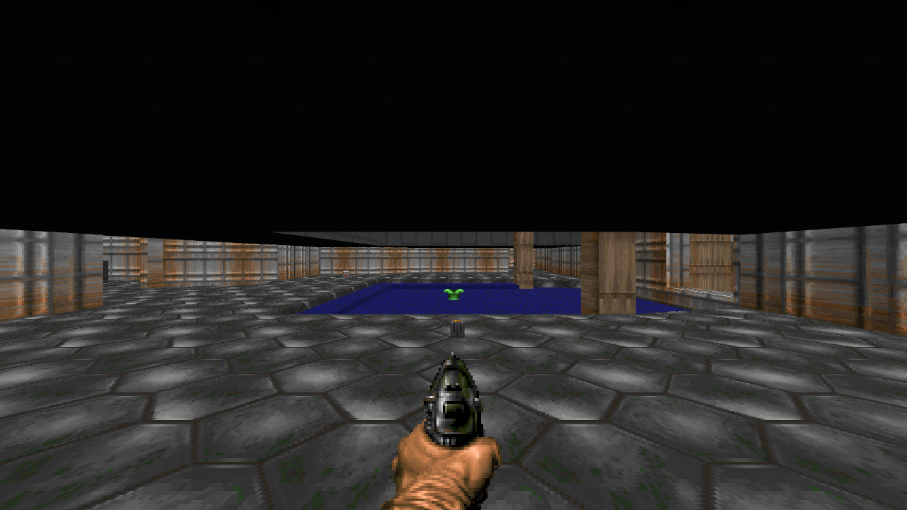

# render-wgpu in the page as WebAssembly on WebGPU (#8874 spike)

**Answer.** The renderer is not the cost:
- `render-wgpu` compiled for `wasm32-unknown-unknown` unchanged.
- It drew the Doom room study on a page canvas with about 80 lines of changes.
- Its Chromium frames are bit-identical to the native renderer's, at 720p and 1080p.

The cost is everything around it:
- **A transport.** It must carry publications and resource bytes into the page.
- **A return channel.** Renderer facts have to reach the runtime.
- **Audio in the page.**
- **Browser reach.** WebGPU only; a WebGL2 fallback would need a different binding model.
- **The product's location.** It stays either on a server per player or in the page as wasm.

**Recommendation: keep it as a documented option. Do not build it now.**

Branch `spike/wasm-renderer-8874`. All numbers are from 2026-09-29 on the workstation in [streaming-8786](../streaming-8786/README.md): AMD RX 9070 XT (RADV), 20 cores, load average 6 to 10 from other lanes.

## Setup

**Fixture.** The Doom room study capture from #8796, the one the retired `render_capture` example read:
- 125 static meshes, 9 materials, 25 textures, 15 sprite atlases, equirect sky;
- `world-frame.json` (28,386,338 bytes, sha256 `7298e37331e9e0da…`), `view.json` and `resources/` (14 files, 2,776,836 bytes).

Nothing can record a new capture since #8792 (#8869). This one survives in `/home/agent/dev/worktrees/re-wgpu/target/render-wgpu-capture`. It is too large to commit.

**Harness.** [`rust/spikes/render-wgpu-web`](../../../rust/spikes/render-wgpu-web). It has its own `[workspace]`, so the Engine workspace metadata and `scripts/dependency_boundary_check.py` do not see it. It depends on `render-wgpu`, never on `wgpu`.
- `load_capture` does what a fresh attachment does:
  1. replay the frame through `PresentationWorld`;
  2. apply its snapshot to a new `Renderer`;
  3. install the view composition.
- **Native half:** `native_reference` draws offscreen and reads back a PNG.
- **Page half:** the `Viewer`, built with wasm-bindgen:
  - `Gpu::for_canvas`;
  - `render_view_composition_to_surface` from `requestAnimationFrame`.
- **The page** (`web/main.js`) fetches the files, hands their bytes to the viewer, and calls `frame`. It draws nothing itself. There is no TypeScript renderer.

```text
cd rust/spikes/render-wgpu-web
cargo run --release --bin native_reference -- <capture> native.png 1280 720 600
WASM_BINDGEN=<wasm-bindgen 0.2.127> scripts/stage.sh <capture> <site>
python3 -m http.server 8874 --directory <site>
PLAYWRIGHT_CORE=render/node_modules/.pnpm/playwright-core@1.61.1/node_modules/playwright-core \
  node scripts/run-browser.mjs http://127.0.0.1:8874 <out> webgpu-1280x720 1280 720
node scripts/run-browser.mjs http://127.0.0.1:8874 <out> shaders --shaders
node scripts/run-firefox.mjs http://127.0.0.1:4445 http://127.0.0.1:8874 <out> firefox --prefs   # geckodriver on 4445
python3 scripts/compare.py native.png <out>/webgpu-1280x720.png
```

The installed `wasm-bindgen` CLI (0.2.123) does not match the locked library (0.2.127). The spike used `cargo install wasm-bindgen-cli --version 0.2.127 --locked --root <dir>`.

## 1. Compile: blockers and changes

`cargo build -p render-wgpu --target wasm32-unknown-unknown` succeeded on 57b98aa18 with no change:
- `render-model`, `render-presentation`, `render-host-contracts` and `render-video` (`matroska-demuxer`, `rusty_vp9`) also compiled;
- so did `fontdue`, `wuff`, `png`, `gltf` and `pollster`.

On wasm32, wgpu's default features select only the WebGPU backend (`webgpu`). Its `webgl` feature is off.

Compiling is not running, though. These are the runtime blockers and what the branch changes:

| Blocker | Found by | Change on the branch | Size |
|---|---|---|---|
| `pollster::block_on` in adapter and device creation. The page cannot block. | source | `Gpu::for_canvas(HtmlCanvasElement)`, async, wasm32 only. The canvas type is wgpu's `web_sys` re-export; no wgpu type is public. | +43 |
| A WebGPU canvas offers no sRGB format (Chromium prefers `rgba8unorm`). The fallback to the first format would have written linear values, too dark. | source | A non-sRGB surface draws its scene through the sRGB view format (`view_formats`) of the same texture. Every target. Native is unchanged, because Vulkan surfaces offer an sRGB format and that path is taken as before. | +21 −5 |
| `std::time::Instant::now` in ghost plate capture panics on wasm32. | source | `web_time::Instant` on wasm32 only. It is already in the lockfile; the target-only dependency is `web-time 1.1`. | +4, +4 manifest |
| The video shader samples after a non-uniform early return. naga accepts it; the WGSL spec and Chromium's Tint reject it (`textureSample must only be called from uniform control flow`), so video pipeline creation failed in the page. | browser console | `textureSampleLevel(…, 0.0)`. The planes have one mip level, so the result is identical. This is a spec fix that is valid everywhere. | +6 −3 |
| Blocking readback: `OffscreenTarget::read_rgba` does `map_async`, then `poll(wait)`, then a channel `recv`. On WebGPU `poll` returns at once and `recv` cannot wait on the page thread. | source | **Not changed.** Presenting needs no readback. `RenderOutput` image jobs (`capture_image`) would need an async readback in the page. | — |
| `web-overlay` (CEF) | manifest | None: it is an off-by-default feature. | — |

Checked and not blocking:
- **GLB export** returns bytes and touches no file.
- **Pick** works on CPU geometry copies.
- **Ghost plates** capture on the GPU with no readback.
- **Threads, files, processes:** none of these crates uses `std::thread`, `std::fs`, `std::net` or `std::process`.
- **Instants elsewhere:** `render-presentation`'s only `Instant` is in a test.

**Every shader in the browser.** The room study never builds some pipelines, so `web/shaders.html` compiles every `render-wgpu` WGSL module with Chromium's compiler, assembled as the renderer assembles it:
- world, shadow, compose, ghost, effects (world plus effects);
- labels with both depth variants;
- video.

On main, 7 of 8 compile; video fails ([shaders-main.json](measurements/shaders-main.json)). On the branch, all 8 compile ([shaders-branch.json](measurements/shaders-branch.json)).

**Native behaviour is unchanged.**
- `cargo test -p render-wgpu` passes on llvmpipe (`WGPU_BACKEND=vulkan`, lvp ICD), including every screenshot reference (85 tests).
- `cargo +stable clippy -p render-wgpu --no-deps` passes with `-D warnings` for both the native and the wasm32 target.
- `dependency_boundary_check.py` still reports 44 packages and 139 edges.

**Not exercised in the page.** The room study has none of these, so they were not drawn:
- labels, particles, sprites-with-effects and shadows. Their shaders compile, but their pipelines were not built.
- video decode. `rusty_vp9` would decode on the page's main thread; its speed there is unmeasured.
- animated GLBs.

## 2. The fixture on a canvas

The capture pair ([`captures/`](captures)): the native renderer (RADV, Vulkan, offscreen, read back) beside `render-wgpu` in headless Chromium 149 (WebGPU through Dawn on the same GPU, canvas screenshot).

| Pair | Differing pixels | Max channel difference |
|---|---|---|
| Native vs Chromium, 1280x720 | **0 of 921,600** | 0 |
| Native vs Chromium, 1920x1080 | **0 of 2,073,600** | 0 |
| Native vs Firefox 156, 1280x720 (WebGPU forced on, below) | 870 (0.09%) | 1 |

In each run:
- the renderer applied every op (0 skipped);
- the tables matched native: 25 textures, 9 materials, 125 static meshes, 155 nodes, 15 atlases;
- the page's console was empty.



## Measurements, beside streaming

**Frame cost.** Medians over 600 frames, drawn from `requestAnimationFrame`:
- the page (`frame` = prepare, encode, submit and present) in [webgpu-1280x720.json](measurements/webgpu-1280x720.json) and [webgpu-1920x1080.json](measurements/webgpu-1920x1080.json);
- native in [native-*.txt](measurements).

Streaming's numbers come from [streaming-8786](../streaming-8786/README.md#latency-and-bandwidth-beside-the-three-path).

| | 720p | 1080p |
|---|---|---|
| **wasm in page:** CPU per frame (median / p90) | 0.2 / 0.4 ms | 0.3 / 0.5 ms |
| **wasm in page:** frame interval | 16.7 ms, a steady 60 fps | 16.7 ms, a steady 60 fps |
| native `render-wgpu`: CPU per frame | 0.11 ms | 0.26 ms |
| streaming, runtime side: render + readback + JPEG encode | 0.53 + 1.16 + 4.48 ms | 0.40 + 1.92 + 8.77 ms |
| streaming, page side: JPEG decode and draw | 7.5 ms | 12.7 ms |
| streaming: bytes per second to the page | 5.3 MB/s frames + 64 KB/s SSE | 10.7 MB/s + 67 KB/s |
| streaming: input to display (median) | 30.9 ms | 65.5 ms |

Notes on these numbers:
- **Page timer resolution.** The page's timer is 0.1 ms in Chromium and 1 ms in Firefox, so the page CPU numbers are coarse.
- **GPU time.** It is not in the CPU number. The steady 16.7 ms interval says the GPU keeps up at both sizes. Native wall time, including the GPU, is 0.15 ms (720p) and 0.29 ms (1080p) per frame.
- **Input to display was not measured.** The fixture is a recorded world with no runtime behind it; step 4 names what that would take.

**Attach and load** (720p page, localhost):

| | Page | Native |
|---|---|---|
| wasm instantiate | 17 ms | — |
| adapter and device | 22 ms | — |
| fetch capture (31.2 MB) | 139 ms | — |
| parse JSON and replay through `PresentationWorld` | 120 ms | 124 ms |
| apply the snapshot to the renderer | 67 ms | 33 ms |
| first frame after script start | 381 ms | — |

**Bundle** (release, `lto`, `codegen-units = 1`; no `wasm-opt`, because binaryen is not installed here):

| File | Raw | gzip -9 |
|---|---|---|
| `render_wgpu_web_bg.wasm` | 2,628,275 | 803,023 |
| `render_wgpu_web.js` (wasm-bindgen glue) | 67,442 | 13,317 |

The embedded DejaVu Sans font (`labels.rs`) is 759,720 bytes of the wasm, 29%. A web build could fetch it on first label instead.

## Browser support found

| Browser (this machine) | WebGPU | Result |
|---|---|---|
| Headless Chromium 149, crew-services GPU flags (`--use-angle=vulkan`, Vulkan features, `--enable-unsafe-webgpu`) | yes (`amd` / `rdna-4`) | Drew the fixture; bit-identical |
| Same, without `--enable-unsafe-webgpu` | yes | Drew the fixture ([no-unsafe-flag.json](measurements/no-unsafe-flag.json)) |
| Headless Chromium 149, no flags | no: GL is SwiftShader, no WebGPU adapter | `no wgpu adapter … webgpu found no adapters` ([plain.json](measurements/plain.json)) |
| Headless Firefox 156, defaults | no: `getContext('webgpu')` is null | `wgpu surface creation failed` ([firefox.json](measurements/firefox.json)) |
| Headless Firefox 156, `dom.webgpu.enabled` alone | no | Same failure |
| Headless Firefox 156, `dom.webgpu.enabled` + `gfx.webgpu.ignore-blocklist` | yes | Drew the fixture; frame interval 17.1 ms; max difference 1 ([firefox-webgpu-pref.json](measurements/firefox-webgpu-pref.json)) |

What these runs show, and what they do not:
- **Chromium on Linux.** It exposes WebGPU with no unsafe flag once its GPU process runs on the hardware. Among the flags tried, only ANGLE on Vulkan got it there headless (`scripts/run-browser.mjs`; a flag-by-flag probe).
- **Firefox on Linux.** This AMD GPU is on its WebGPU blocklist by default.
- **Headed browsers were not run.** They may differ from headless.
- **Windows and macOS were not reached.** No such machine was available.
- **Failure is clean in every case.** The page gets a typed error from `Viewer.create`, so a page can choose another output (streaming) without a TypeScript renderer.

**WebGL2 fallback: not worth anything without a redesign.** A throwaway, uncommitted experiment ([webgl2-experiment.txt](measurements/webgl2-experiment.txt)) turned on wgpu's `webgl` feature with `Backends::GL`:
- It first failed at the device request, on WebGPU limits.
- Requesting the adapter's own limits, it failed at `Surface::configure` on the missing `SURFACE_VIEW_FORMATS` downlevel flag.
- Behind that, the renderer's binding model needs storage buffers: world (4), shadow (3), ghost (1). WebGL2 has none.
- A fallback would mean packing parts, lights and instances into uniforms or textures: a second data layout for the whole renderer.
- It would also double the wasm (5.7 MB).

## 3. The data path

### What the page would need

The page needs exactly what the runtime hands its in-process renderer today. `csharp-product-runtime/src/frame_output.rs` → `render-stream`'s `SceneDriver` gets:
- **Per committed call:** the `Frame(RenderFrameDiff)`, `ViewComposition` and `Presentation(PresentationFrameDiff)` publications, in order, with a `SceneState` (presentation time, step, held).
- **Resource bytes by content identity** (`texture-resource/<sha256>`), read synchronously through `ResourceSource`.
- **Entity world positions** for presentation effects (`EntityPositions`). A page-side `PresentationWorld::entity_world_position` answers this for retained entities, as the old `render_capture` did.
- **A baseline for a new viewer** (`rebaseline`): `PresentationWorld::snapshot()` with the current composition and presentation baseline.

### Can the types be sent as they are?

**Yes.**
- `RenderFrameDiff`, `PresentationFrameDiff` and `RendererViewComposition` are serde types.
- The fixture is a `RenderFrameDiff` read from JSON, and the page applied it unmodified.
- No mirrored contract or TypeScript decoder is needed: the page only moves bytes into wasm.

### Size

For the room study, a fresh attach is:
- a 28.4 MB JSON baseline, of which **25.3 MB is the 125 `defineStaticMesh` ops' vertex arrays written as JSON numbers** (2.96 M numbers);
- plus 2.8 MB of PNG resources.

On the wire:
- gzip takes the JSON to 4.0 MB;
- the same numbers as raw 4-byte binary are 11.8 MB.

Either is a one-time cost per attach, against streaming's 5.3 MB every second. After attach, the deltas are the product's changes. The Three path received 64 KB/s of these for an idle Doom ([streaming-8786](../streaming-8786/README.md#latency-and-bandwidth-beside-the-three-path)).

### The smallest transport

1. **One ordered, reliable stream per viewer** (a WebSocket or chunked HTTP response). Each committed call's renderer publications and `SceneState` go as one message, compressed (per-message deflate, or a binary encoding for mesh vertex arrays).
2. **Attach sends the snapshot first.** That is the same baseline `rebaseline` already builds in process. A dropped connection is a new attach, the same as a page reload.
   - No publication frontiers, replay, receipts or validation.
   - An ordered reliable stream has no gaps to recover.
3. **Resources before the ops that name them.** The runtime knows every identity a frame references (`TexturePayloadSource::Resource`, mesh payload resources). It sends each identity's bytes once per connection, ahead of the first op that uses it. The renderer's synchronous `ResourceSource` then stays as it is.
   - The alternative: the page scans each message for unknown identities and fetches them (immutable, cacheable by hash) before applying. That adds a round trip whenever new content appears.

### What #8792 removed and this would not restore

- The recovery, replay and validation layers.
- The TypeScript realizers. Only the transport of already-typed publications comes back.

### What else must exist besides the renderer

- **A return channel.** The runtime ingests renderer facts from drawn frames:
  - animation completions and mesh inspections (`ingest_animation_realization_feedback`);
  - video completions;
  - ghost plate readouts;
  - renderer diagnostics.

  A page renderer must send these back, one round trip late. With several viewers, exactly one must be authoritative.
- **Inspection.** Live-debug `engine.renderer.*`, observer camera and picking run against the renderer, so they become requests to the page.
- **Audio.** `render-audio` plays on the runtime's own output device. A remote viewer hears nothing until audio publications also go to the page, with a browser audio host for them.
- **Input** already goes from the page to the runtime over the existing host routes; nothing new is needed.

## 4. Where the product runs

**The spike assumed the renderer alone in the page.** It had no product at all: a recorded world.

### Shape A: C# product and Engine services native, renderer in the page (remote play)

The server runs `rusty` (CoreCLR) per session and sends publications, not frames.

What it needs:
- the transport, return channel and audio above;
- a WebGPU browser.

What it gives:
- a thin wire: a one-time attach of about 4 MB gzipped for this room, then product deltas;
- display-rate drawing in the page;
- no GPU needed on the server.

What it does not remove:
- **Latency.** Input to display is still one network round trip plus a product step. The page redraws camera motion locally only where the composition already carries it (`motion`).
- **Prediction.** Hiding the round trip needs client-side prediction, which is product logic. The Engine cannot supply it generically.

### Shape B: everything in the page (C# and Rust as wasm)

Recorded, not attempted. It would need all of the following:
- **The product.** .NET in the browser (Mono `browser-wasm` or experimental NativeAOT-LLVM) in place of CoreCLR through `hostfxr`. The generated C#↔Rust function table would bind inside one page instead of a native library.
- **Engine services** (`csharp-engine-services`, `csharp-product-runtime`, spatial, physics, content store) built for wasm32:
  - their threads need wasm threads (SharedArrayBuffer with COOP/COEP);
  - their file-backed content store needs fetch or browser storage.
- **Host integration.** Lifecycle, input and audio hosts reimplemented against browser APIs.

It is the only shape that deploys to the web without a server per player. It is a port of the whole runtime, far larger than this renderer change.

## Recommendation

**Keep it as a documented option. Do not build it now.**
- **The renderer part is cheap and proven.** The wasm32-only additions are a small code change. The other two changes (the sRGB view for a non-sRGB surface and the uniform video sampling) are correct on every target. The output matches native bit for bit.
- **Neither deployment shape is cheap.**
  - Shape A needs a server per player, a new transport, a return channel and audio in the page, and it keeps a network round trip in every input.
  - Shape B is a runtime port.
- **Reach is narrower than the web.**
  - WebGPU only: WebGL2 would need a second binding model.
  - Firefox on Linux blocklists this GPU by default.
  - Headless Chromium needs a hardware GPU process.
- **The desktop window and streaming already cover the current deployment and development paths.**

The video shader's uniformity fix corrects main independently of any web build, and a follow-up task proposes landing it.
