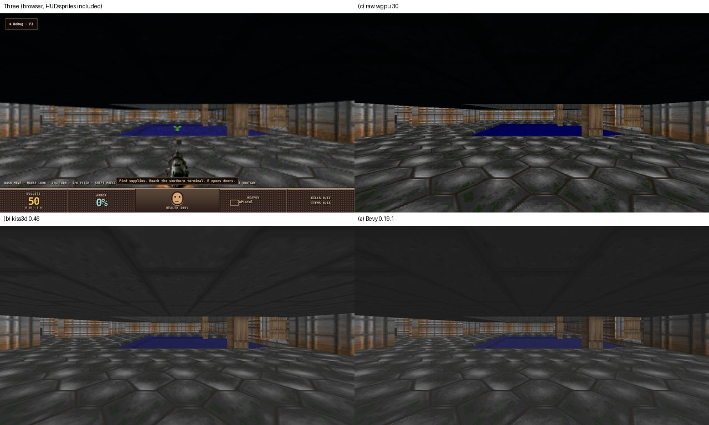

# wgpu bootstrap spike: Bevy, kiss3d and raw wgpu on one Doom room (#8796)

**Decision: write new on raw wgpu.** Every candidate rendered the room correctly
on the runtime's own device, headless, with the host driving each frame. The
time it took an agent to reach the first image differed by minutes. What
differs is what each candidate costs afterwards: a second world model, a
different wgpu version, longer compiles and a larger binary. None of the
candidates covers the Engine-specific families either. The Den decision is
`rusty-engine/wgpu-bootstrap-decision`.



Top left: the current Three renderer in headless Chromium, with HUD, sprites
and the weapon viewmodel. The others are the candidates, with sprites
excluded for all three.

## Setup

- **Scene.** Doom `LOADING_BAY_SCENE=room-study` (rusty-doom `0a881b2`, pinned
  pack `playtest-development-20260928k`, Engine `4cce6e9d`), from a fresh
  attachment baseline. The captured frame has 125 `defineStaticMesh`, 125
  `createStaticMeshInstance`, 25 `defineTexture`, 9 `defineMaterial`, 1
  `setSkyBackground`, and 15 atlases with 30 sprites. The camera sits at
  (-7, 1.62, 3), yaw 0, fovY 90°. `world-frame.json` has sha256 `7298e373…`.
- **Capture.** `capture-fixture.py` (now `rust/crates/render-wgpu/scripts/capture-presentation.py`) reads
  `/__rusty/product/runtime/outputs/fresh` and the texture resources from a
  running room study. The 28 MB fixture is not committed.
- **Shared loader.** `bootstrap-fixture` replays the frame into
  `PresentationWorld`. Each candidate gets `world.snapshot().frame.ops`, the
  same baseline delta a fresh backend receives.
- **Rendering.** Same 1280×720 target size, and the Three lane's neutral rig
  (hemisphere 2.4 plus directional 2.2 from (5, 8, 6), no shadows, no tone
  mapping).
- **Device.** The host creates the instance, adapter, device and queue in every
  candidate.
- **Adapters.** Primary: AMD RX 9070 XT, RADV Vulkan. All three also render on
  llvmpipe Vulkan with `WGPU_BACKEND=vulkan
  VK_ICD_FILENAMES=/usr/share/vulkan/icd.d/lvp_icd.json`, so CI can use
  software Vulkan and needs no GPU runner.
- **Location.** The prototypes lived in a separate Cargo workspace,
  `rust/prototypes/wgpu-bootstrap`, which no Engine crate could depend on.
  Nothing was wired into production. #8815 deleted it; see "Reproduce".

## Measurements

The clock is wall time from the first line of candidate code to a correct PNG.
The shared fixture took about 5 minutes and is excluded.

| | (c) raw wgpu 30.0.1 | (b) kiss3d 0.46.0 | (a) Bevy 0.19.1 |
|---|---|---|---|
| Time to first correct image | ~3 min, correct on first run | ~4 min: MSRV fix, then shadow and tonemap defaults | ~7 min, including a 3:17 dependency build and one device-feature fix |
| Files / lines | 1 / 760 (70 WGSL, 85 target and readback) | 1 / 258 | 1 / 410 (70 target and readback) |
| Mirror into the candidate's world | none: `apply` writes GPU tables directly | ~140 lines to `SceneNode3d` plus thread-local managers | ~170 lines to Bevy entities and assets |
| Extra dependency crates (fixture alone: 31) | +57 (88) | +218 (249) | +274 (305, 53 of them `bevy_*`) |
| Clean dev build, extra over fixture (9.9 s) | +9.8 s | +37.4 s | +104.4 s |
| Clean release build, extra over fixture (23.8 s) | +8.7 s | +61.0 s | +167.6 s |
| Incremental rebuild of the candidate file (dev / release) | 0.5 / 0.8 s | 1.1 / 1.3 s | 2.6 / 1.6 s |
| Stripped release binary, extra over fixture (1.9 MB) | +5.7 MB | +15.1 MB | +78.3 MB |
| Peak RSS for one frame | 112 MB | 132 MB | 218 MB |
| wgpu version | 30.0.1 (latest) | 30.0.1 | **29.0.4**; 30 only in 0.20.0-rc.2 |
| Toolchain | 1.95 | latest `wesl` 0.4.4 needs **rustc 1.97.1**; resolved to 0.4.0 through the MSRV fallback | 1.95 (Bevy's MSRV is exactly 1.95.0) |
| Device sharing | the host's device | the host's device, installed with `Context::init` into a thread-local global | the host's device, through `RenderCreation::Manual`. Bevy normally opts into experimental wgpu features with `unsafe`; the host masks them out |
| Headless, host-driven | yes | yes (`OffscreenSurface`, async `render_3d`) | yes: runner discarded, `SubApps::update` pumped, `WindowPlugin` still required |
| Renders into the host's texture | yes | **no**: kiss3d owns the target, and the host copies out of it | yes (`ManualTextureViews`) |
| Frames until the baseline appears | 1 | 1 | 1 (with synchronous pipeline compilation) |

Build times ran on a shared 20-core machine while other lanes were building,
so they are indicative, not a benchmark. `measure-build.sh` in the spike commit reproduces them; raw rows are in `build-times.tsv`.

## Fidelity on this scene

- **raw.** Matches the reference apart from the excluded sprites. The ceiling
  goes dark as in Three, because the hemisphere light's ground color is dark.
- **kiss3d.** Has no hemisphere light, so a flat ambient term lights the
  ceiling. Its only texture path with repeat wrapping filters linearly, while
  the Doom textures ask for nearest. Its skybox also switches on image-based
  lighting, which the Three lane does not do. Before it matched, it cast
  shadows by default (the ceiling blacked out the floor) and tone-mapped by
  default.
- **Bevy.** Nearest filtering and repeat wrapping are honored. It has no
  hemisphere light (same flat-ambient difference as kiss3d). Its `Skybox` needs
  a cubemap, so the equirectangular sky needs a conversion pass that was not
  written here. On the GL backend it fails with a validation error; GL is not a
  target.

## Family coverage today

| Family | raw | kiss3d | Bevy |
|---|---|---|---|
| PBR materials | write new | yes | yes |
| Shadows | write new | cascaded directional, point, spot | cascaded, point, spot, contact |
| Skinning | write new | GPU deform path (skin and morph) | yes, glTF-driven |
| Instancing | write new | yes | automatic batching and GPU preprocessing |
| Render-to-texture | yes (built here) | only into its own target | yes |
| Sprites / billboards | write new | 2D only, no 3D billboard | 2D sprites only; billboards via an old third-party crate |
| Particles | write new | no | bevy_hanabi (separate, Bevy-coupled) |
| Hemisphere light, equirect sky, ghost plates, voxel surfaces, telemetry overlay | write new | write new | write new |

## Why raw wgpu

1. **No real speed-up.** At agent speed, a correct room took minutes with every
   candidate. The families a bootstrap would bring sooner are shadows, skinning
   and PBR. Each is a bounded module in a typed-table backend. The families that
   carry Engine meaning are write-new under every candidate: the billboard modes
   and viewport placement, ghost plates, voxel surfaces, the hemisphere/sky
   defaults and telemetry.
2. **Every bootstrap brings a second model.** kiss3d and Bevy each need a
   mirror of retained state into their own world. It is 140–170 lines for three
   op kinds, out of the 30 `RenderDiff` variants plus the presentation
   families. Each new capability then touches the mirror too, which worsens the
   tracked measure until the mirror is gone.
3. **Pin and toolchain cost.** Bevy stable ties the workspace to wgpu 29 while
   30 is current. kiss3d's shader dependency already needs a newer rustc than
   the workspace uses.
4. **Compile and size cost.** The 60–170 s extra clean release build and the
   15–78 MB extra binary are paid for as long as the bootstrap exists. The
   exit cost is close to writing the renderer, which the raw prototype shows
   is not large.

The candidates remain useful as reading material: Bevy's cascades and
clustering, and kiss3d's single deform path for skinning and morph. No crate
from them is adopted.

## Reproduce

The prototype workspace was deleted by #8815 once `render-wgpu` (#8783)
rendered the same capture. Check out the spike commit to rerun it:

```bash
git worktree add ../wgpu-bootstrap-8796 6a88d6c7c
cd ../wgpu-bootstrap-8796/rust/prototypes/wgpu-bootstrap
python3 capture-fixture.py            # against a running `bash scripts/run-room-study.sh` in rusty-doom
cargo run --release -p bootstrap-raw  # writes out/raw.png; also -p bootstrap-kiss3d, -p bootstrap-bevy
./measure-build.sh /path/to/scratch   # writes out/build-times.tsv
```

On current main, the same capture renders through the production crate:
`rust/crates/render-wgpu/scripts/capture-presentation.py`, then
`cargo run -p render-wgpu --example render_capture -- <dir> <out.png>`.
